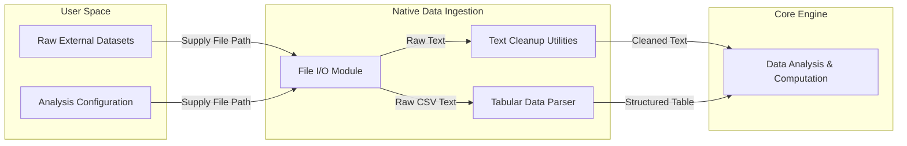
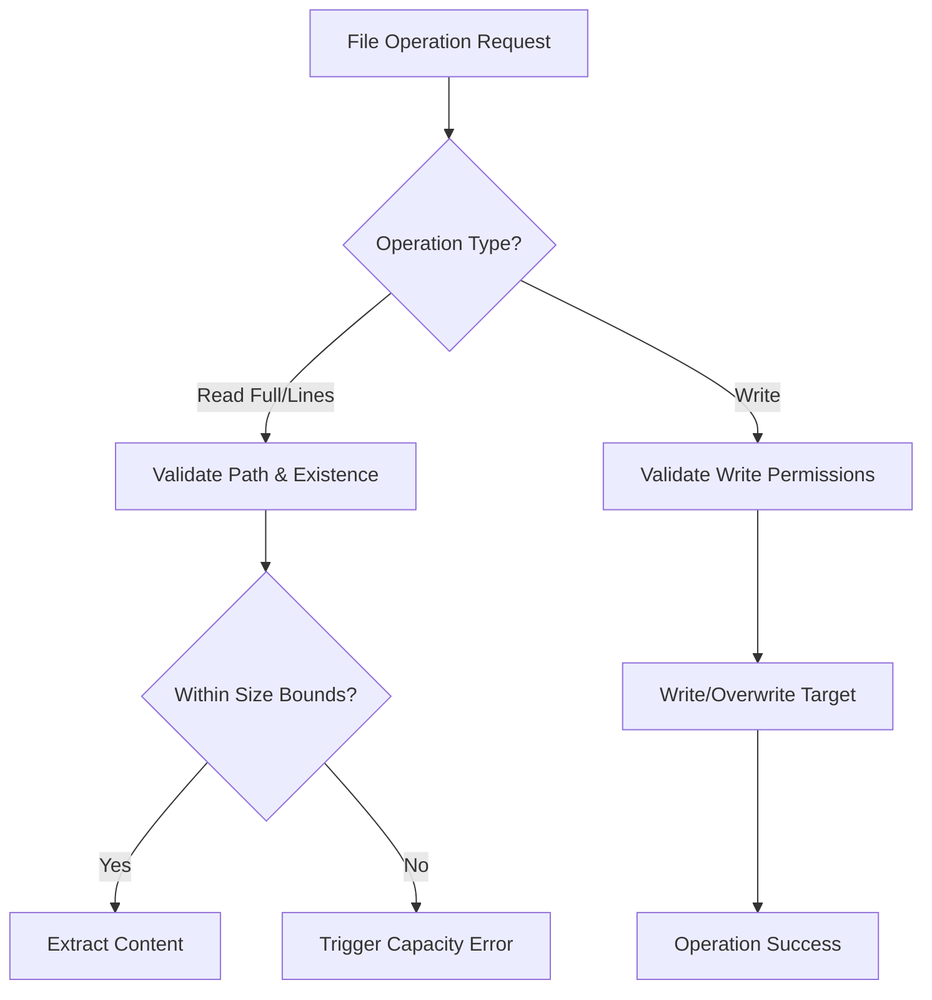
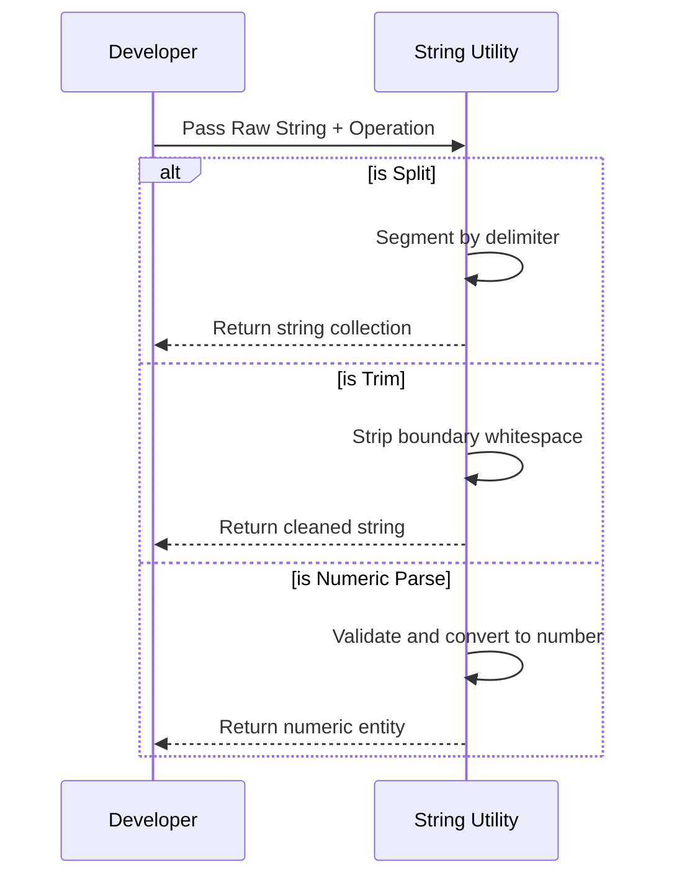
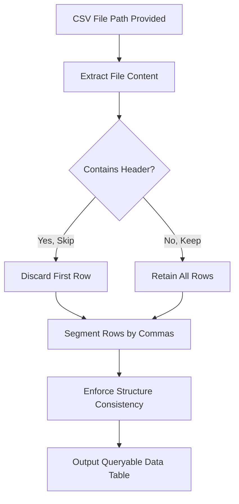

# Native File I/O and Tabular Data Ingestion Feature Plan

## Requirement Overview
Introduce native file handling and tabular data ingestion capabilities to eliminate manual preprocessing, allowing scientific researchers to seamlessly load, parse, and analyze real-world datasets directly within the core analysis engine.



## Requirement List
1. File Read and Write Operations
2. String Cleaning and Type Conversion Utilities
3. Tabular Data (CSV) Ingestion
4. Resource Constraint Guardrails

---

## Detailed Design

### Module 1: File Read and Write Operations

**Logic Flow:**


**Interaction Points:**
- Input: Developer supplies an absolute or relative file path and desired operation.
- Output: System yields text content (full or line-by-line) or confirmation of successful write.

**Visual Design Highlights (Terminal Feedback):**
```text
[ERROR] File Operation Failed
Reason: Target file not found at specified path.
Action: Verify the path exists and the application has read permissions.
```

**Acceptance Criteria:**
- [ ] System successfully extracts complete text from specified files.
- [ ] System supports line-by-line extraction bounded by predefined limits.
- [ ] System successfully writes or overwrites text to designated file paths.
- [ ] Missing files or permission blocks trigger standardized, actionable error messages.

---

### Module 2: String Cleaning and Type Conversion Utilities

**Logic Flow:**


**Interaction Points:**
- Input: Raw text string combined with parsing criteria (e.g., delimiter character).
- Output: Segmented strings, cleaned strings, or strictly typed numerical data.

**Acceptance Criteria:**
- [ ] Text is accurately divided into segments based on user-defined delimiters.
- [ ] Extraneous leading and trailing whitespace is completely removed.
- [ ] Valid numeric strings reliably convert to standard numerical formats.
- [ ] Unparseable numeric strings halt the operation with a clear type-mismatch error.

---

### Module 3: Tabular Data (CSV) Ingestion

**Logic Flow:**


**Interaction Points:**
- Input: CSV file path and header handling preference (skip or retain).
- Output: Structured tabular data mapped to internal table representations.

**Visual Design Highlights (Ingestion Summary Wireframe):**
```text
┌─ Data Ingestion Report ───────────────┐
│ Target:  dataset_spanish_edges.csv    │
│ Status:  Success                      │
│ Rows:    13,150 extracted             │
│ Columns: 2 structured                 │
└───────────────────────────────────────┘
```

**Acceptance Criteria:**
- [ ] System processes comma-separated text into structured row/column formats.
- [ ] System accurately honors flags to bypass header rows.
- [ ] Tabular ingestion remains strictly within system-defined max row/column boundaries.

---

### Module 4: Resource Constraint Guardrails

**Interaction Points:**
- Transparent constraints operating silently in the background, surfacing only when safe computing boundaries are breached to prevent memory exhaustion.

**Visual Design Highlights (Constraint Breach Wireframe):**
```text
┌─ Resource Guardrail Triggered ────────┐
│ Operation: CSV Ingestion              │
│ Limit:     MAX_ROWS (10,000)          │
│ Detected:  15,000 rows                │
│ Result:    Operation Halted           │
└───────────────────────────────────────┘
```

**Acceptance Criteria:**
- [ ] Total file size limits are enforced on all read operations.
- [ ] Collection limits are strictly applied to line-by-line reads and CSV rows/columns.
- [ ] Breaching limits guarantees a safe operational halt rather than a system crash.

---

## Edge Cases

| Scenario | Trigger Condition | Handling | Fallback |
|----------|-------------------|----------|----------|
| Missing File | Target path is non-existent | Display standard "File Not Found" error | Halt execution; suggest path verification |
| Permission Denied | OS denies read or write access | Display standard "Access Denied" error | Halt execution; suggest permission review |
| Memory Boundary | File/Table exceeds maximum defined limits | Display "Resource Guardrail Triggered" block | Halt load; suggest dataset chunking |
| Structural Anomaly | Tabular rows contain mismatched column counts | Log warning for specific malformed row | Halt parsing; provide exact row number for correction |
| Invalid Type Cast | Parsing non-numeric text to number | Display "Type Mismatch" error | Halt operation; highlight invalid text block |

## Data Specification

**Key Metrics & Tracking Points:**
- **Event Name:** `dataset_ingestion_success`
  - *Trigger Conditions:* File or tabular dataset fully loaded into analysis engine.
  - *Key Attributes:* `file_format` (text/csv), `file_size_bytes`, `total_rows`.
- **Event Name:** `dataset_export_success`
  - *Trigger Conditions:* Text successfully written to external file.
  - *Key Attributes:* `output_size_bytes`.
- **Event Name:** `guardrail_trigger`
  - *Trigger Conditions:* Operation halted due to exceeding maximum resource limits.
  - *Key Attributes:* `limit_type` (file_size, row_count, col_count), `attempted_size`.

**Minimal KPI Set:**
1. **Data Ingestion Success Rate:** Percentage of file read/parse requests completing without structural or resource errors.
2. **Limit Breach Frequency:** Frequency of guardrail triggers, indicating if default bounds require expansion for researchers.
