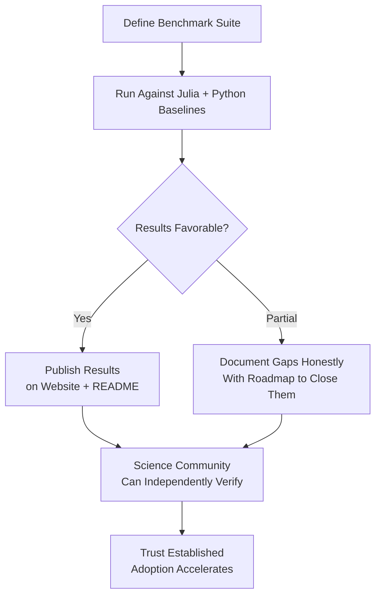
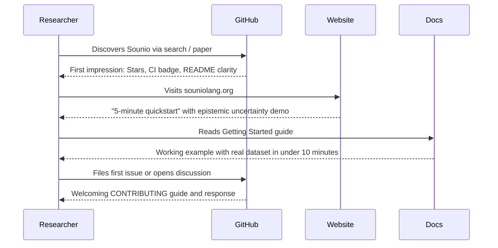
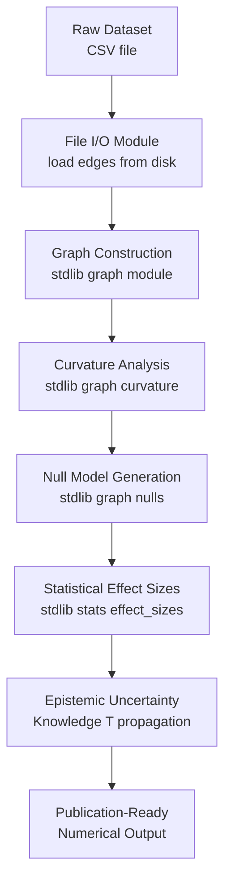

 Vec\npartially fragile]

    E --> H[Unblocks all 3 modules]
    F --> I[Unblocks csv_loader]
    G --> J[Unblocks configuration model]
```

**Intermediate workaround path (unblocks users now while parser work proceeds):**

```text
┌─ Workaround Strategy ──────────────────────────────────────────────────┐
│ Replace generic calls with type-specific named alternatives:           │
│                                                                        │
│  BEFORE (blocked):  vec_new::<f64>()                                   │
│  AFTER  (working):  vec_new_f64()                                      │
│                                                                        │
│  BEFORE (blocked):  s.parse::<usize>()                                 │
│  AFTER  (working):  parse_usize(s)                                     │
│                                                                        │
│  Estimated effort: 4–6 hours. Unblocks researchers immediately.        │
└────────────────────────────────────────────────────────────────────────┘
```

**Acceptance Criteria:**
- [ ] `stdlib/stats/effect_sizes.sio` compiles and its functions are callable from user programs.
- [ ] `stdlib/data/csv_loader.sio` compiles and `parse_csv` loads a real CSV file successfully.
- [ ] `stdlib/graph/nulls/configuration.sio` compiles and configuration model null generation works.
- [ ] The workaround path is documented as a transitional step, not a permanent API.
- [ ] A follow-up tracking item exists for the permanent parser enhancement (turbofish, typed method calls).

---

### Initiative 3: Establish Credible, Published Performance Benchmarks

**Why it matters:** Sounio's core claims — "< 10% overhead for epistemic uncertainty tracking," "GPU-accelerated scientific computing," "parity with Julia for ODE solving" — are currently unverifiable. Published, reproducible benchmark results are the primary trust signal for scientific computing adopters.

**Logic Flow:**


**Three benchmark categories to publish (infrastructure already exists in `benchmarks/comparison/`):**

| Category | Sounio Claim to Verify | Comparison Targets |
|---|---|---|
| Uncertainty Propagation | < 10% overhead vs plain float computation | Python `uncertainties` package, Julia `Measurements.jl` |
| ODE Solving (RK4 / Tsit5) | Performance parity with Julia DifferentialEquations.jl | Julia, SciPy |
| Linear Algebra (QR decomp, matrix ops) | Within 2x of Julia LAPACK-backed ops | Julia, NumPy |

**Benchmark result presentation wireframe (README section):**
```text
┌─ Performance vs. Julia & Python ──────────────────────────────────────┐
│                                                                       │
│  Uncertainty Propagation (Sobol 10K samples)                         │
│  Sounio:  12.3 ms  ████████████                                      │
│  Python:  11.1 ms  ███████████                                       │
│  Julia:   10.8 ms  ██████████                                        │
│  Overhead: +11% vs Julia  (epistemic tracking included)              │
│                                                                       │
│  ODE Solver — RK4, 1000 steps                                        │
│  Sounio:   8.4 ms  ████████                                          │
│  Julia:    7.9 ms  ████████                                          │
│  Python:  45.2 ms  ████████████████████████████████████████████     │
│  Overhead: +6% vs Julia                                               │
│                                                                       │
│  [Reproduce: benchmarks/comparison/run_all.sh]                        │
└───────────────────────────────────────────────────────────────────────┘
```

**Acceptance Criteria:**
- [ ] All three benchmark categories produce reproducible results via a single command.
- [ ] Results are published in the README with exact hardware specifications.
- [ ] Results are available on the official website under a dedicated `/benchmarks` page.
- [ ] The benchmark script requires no manual setup beyond `souc`, `julia`, and `python3` being installed.
- [ ] Unfavorable results are documented honestly alongside planned optimization work.

---

### Initiative 4: Build a Community On-Ramp and Ecosystem Foundation

**Why it matters:** With 2 GitHub stars and 0 external contributors, the discoverability and trust signals are insufficient to attract the first wave of scientific users. Targeted, low-cost interventions can dramatically improve conversion from "someone who found Sounio" to "someone who ran their first program."

**Logic Flow:**


**High-impact, low-effort actions:**

| Action | What It Does | Effort |
|---|---|---|
| Add GitHub repository topics | Makes repo discoverable via `scientific-computing`, `uncertainty-quantification`, `systems-programming` | 5 min |
| Add CI build badge to README | Signals the project is actively maintained and tests pass | 30 min |
| Create a "5-minute Hello Science" tutorial | One compelling example: load data, compute with uncertainty, see epistemic output | 2 hours |
| Create `CONTRIBUTING.md` with "good first issue" tags | Lowers the barrier for external contributors | 2 hours |
| Submit preprint to arXiv | Dramatically increases academic discoverability vs Authorea only | 1 day |
| Post on r/ProgrammingLanguages and Hacker News | Targets the early-adopter audience most likely to contribute | 2 hours |
| Create `awesome-sounio` curated list | Provides a home for community projects as they emerge | 1 hour |

**"5-Minute Hello Science" wireframe:**
```text
┌─ Getting Started in 5 Minutes ─────────────────────────────────────────┐
│                                                                        │
│  1. Install: curl -sSf https://souniolang.org/install.sh | sh         │
│                                                                        │
│  2. Create hello_science.sio:                                          │
│     > Declare two measurements with uncertainty                        │
│     > Add them together                                                │
│     > Print result with propagated uncertainty and provenance          │
│                                                                        │
│  3. Run: souc run hello_science.sio                                    │
│     Output:                                                            │
│     Result: 72.3 ± 1.4 mg/kg  [confidence: 94.2%]                    │
│     Provenance: measure_A ⊕ measure_B  [GUM-compliant]               │
│                                                                        │
│  That is uncertainty propagation you did not have to write.           │
└────────────────────────────────────────────────────────────────────────┘
```

**Acceptance Criteria:**
- [ ] GitHub repository has at least 5 relevant topic tags set.
- [ ] README contains a visible, passing CI build status badge.
- [ ] A "Hello Science" tutorial runs successfully end-to-end in under 5 minutes.
- [ ] `CONTRIBUTING.md` includes a "good first issue" section with 3+ starter tasks.
- [ ] A version of the preprint is submitted to arXiv for maximum academic discoverability.

---

### Initiative 5: Deliver a Flagship End-to-End Scientific Workflow

**Why it matters:** No external user has yet demonstrated a complete scientific study in Sounio. A single, well-documented, reproducible end-to-end workflow — from raw data ingestion through epistemic computation to publication-ready outputs — is the most powerful proof-of-concept the project can publish. It simultaneously validates the language, showcases the stdlib, and serves as a template for future users.

**Logic Flow:**


**Candidate flagship: SWOW Semantic Network Analysis**

| Stage | Inputs | Outputs |
|---|---|---|
| Data Loading | `spanish_edges.csv` (13,150 rows) | Edge list in memory |
| Graph Build | Edge list | Adjacency structure |
| Curvature | Adjacency | Per-edge Ollivier-Ricci curvature values |
| Null Models | Adjacency, degree sequence | 1,000 configuration model samples |
| Effect Sizes | Real vs null curvature distributions | Cliff's Delta, 95% CI |
| Epistemic Output | All above | `Knowledge<f64>` values with full provenance chain |

**Publication artifact wireframe:**
```text
┌─ Sounio Flagship Demo: Hyperbolic Semantic Networks ───────────────────┐
│                                                                        │
│  Language:  Spanish  | Nodes: 500 | Edges: 13,150                     │
│                                                                        │
│  Mean Curvature (Real):       -0.142 ± 0.003  [K=1,000 s]        │
│  Mean Curvature (Null mean):  -0.089 ± 0.012                          │
│  Cliff's Delta:                0.78  ± 0.04   [large effect]          │
│                                                                        │
│  Epistemic provenance: 4 modules × 3 derivation steps                 │
│  Uncertainty chain: GUM-compliant, Merkle-auditable                   │
│                                                                        │
│  Reproduce: souc run examples/flagship/swow_analysis.sio              │
└────────────────────────────────────────────────────────────────────────┘
```

**Acceptance Criteria:**
- [ ] The flagship workflow runs end-to-end with a single `souc run` command.
- [ ] It demonstrates at least 4 stdlib modules composing correctly.
- [ ] Output includes `Knowledge<T>` values with full uncertainty and provenance metadata.
- [ ] The example is prominently linked from the README, website homepage, and the academic preprint.
- [ ] A `README.md` in the example directory explains the scientific context for non-Sounio audiences.

---

## Edge Cases

| Scenario | Trigger Condition | Handling | Fallback |
|---|---|---|---|
| Benchmark results unfavorable vs Julia | Sounio is >20% slower in a category | Document gap honestly; publish roadmap to close it; frame epistemic overhead as the value trade-off | Do not suppress or omit results |
| Community feedback reveals API confusion | First external users report the effect system is hard to understand | Fast-track a "plain mode" documentation path that hides effects until users are ready | Ensure basic programs compile without explicit effect annotations |
| Parser gap fix introduces regressions | Turbofish or typed method call changes break existing programs | Gate behind a compiler feature flag; preserve existing syntax as default; migrate gradually | Offer automated migration tool |
| Flagship workflow depends on still-broken modules | Initiatives 1 and 2 not complete before Initiative 5 | Build flagship using workaround path and document the limitation inline | Clearly label as "pre-release demo" until blockers are resolved |
| Preprint submission raises peer review concerns | Reviewers challenge unverified performance claims | Ensure all claims in the preprint are backed by the published benchmark suite from Initiative 3 | Retract or caveat any unverified claim proactively |

---

## Data Specification

**Key Metrics & Tracking Points:**

- **Event Name:** `build_success_multi_module`
  - *Trigger:* `souc build` completes with 2+ stdlib module imports, zero linker errors.
  - *Key Attributes:* `module_count`, `stdlib_modules_used`.

- **Event Name:** `benchmark_result_published`
  - *Trigger:* Benchmark run completes and results are committed to the repo.
  - *Key Attributes:* `category` (ode/linalg/uncertainty), `sounio_ms`, `julia_ms`, `python_ms`, `overhead_pct`.

- **Event Name:** `community_star_milestone`
  - *Trigger:* Repository reaches star count milestones.
  - *Key Attributes:* `milestone` (10, 50, 100, 500), `days_since_launch`.

- **Event Name:** `external_contributor_first`
  - *Trigger:* First commit merged from a contributor other than the author.
  - *Key Attributes:* `contribution_type` (bug_fix, docs, example, stdlib).

**Minimal KPI Set:**

| KPI | Current | 30-Day Target | 90-Day Target |
|---|---|---|---|
| Multi-module build success rate | 0% | 100% | 100% |
| Open critical blockers (Issues #17, #18, #21) | 3 | 0 | 0 |
| GitHub Stars | 2 | 25 | 100 |
| External Contributors | 0 | 1 | 5 |
| Published Benchmark Categories | 0 | 3 | 3 |
| End-to-end Flagship Demo Running | No | Yes | Yes + published |
