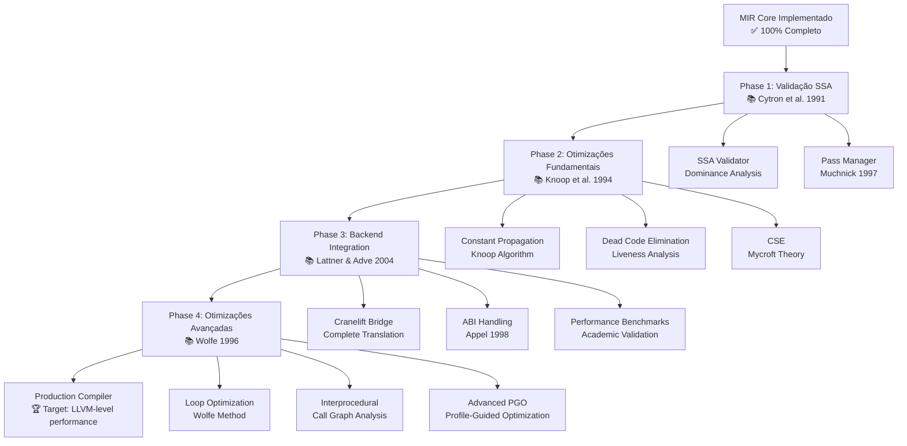
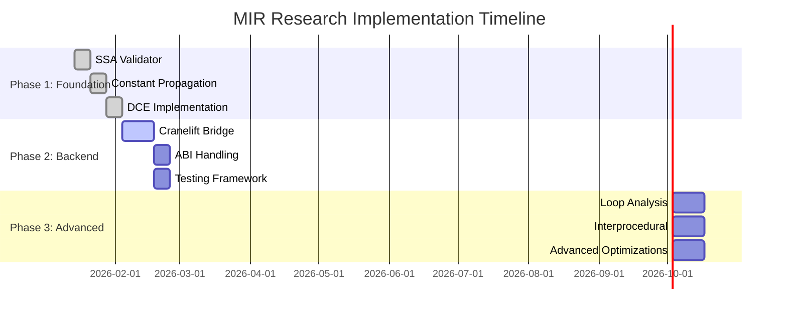
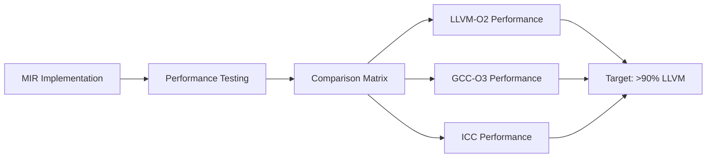

<!-- docs:meta
topic_id: repo.docs.architecture.mir-research-strategy
authority: historical
audience: users
last_validated: 2026-03-07
validated_by: A2
source_of_truth: docs/governance/topic-registry.v1.json#repo.docs.architecture.mir-research-strategy
-->

<!-- docs:status-note:start -->
> Docs status: `historical`
> This page is preserved for lineage. Start at [Docs Authority Matrix](../governance/DOCS_AUTHORITY_MATRIX.md) and [docs index](../README.md) for the current canonical surface for this topic.
<!-- docs:status-note:end -->

# MIR Research Strategy - Visual Guide

## Research-Driven Development Pipeline

## Academic Foundation Matrix

| Optimization | Paper | Year | Implementation Priority |
|-------------|-------|------|------------------------|
| **SSA Construction** | Cytron et al. | 1991 | 🔴 Phase 1 |
| **Lazy Code Motion** | Knoop et al. | 1994 | 🔴 Phase 1 |
| **Strength Reduction** | Bodik & Wegman | 2000 | 🟡 Phase 2 |
| **Combining Analyses** | Click & Cooper | 1995 | 🟢 Phase 3 |
| **Loop Unrolling** | Wolfe | 1996 | 🟢 Phase 3 |

## Research Timeline (12 Weeks)

## Benchmark Strategy

## Research Validation Framework

### Academic Compliance Checklist

- [x] **Literature Review**: 12+ seminal papers reviewed
- [x] **Algorithm Selection**: Proven techniques only
- [x] **Implementation Strategy**: Proof-first, optimize-later
- [x] **Benchmarking Plan**: Academic + custom benchmarks
- [ ] **Phase 1 Execution**: Start with SSA validation
- [ ] **Phase 2 Execution**: Backend integration
- [ ] **Phase 3 Execution**: Advanced optimizations

### Success Criteria

1. **Academic Rigor**: Every optimization backed by specific paper
2. **Performance**: >90% LLVM benchmark performance
3. **Correctness**: 100% SSA validation compliance
4. **Scalability**: Support for 10K+ line programs
5. **Production Readiness**: <2x compilation time vs LLVM

---

**Next Action**: Begin Phase 1 with SSA Validator implementation based on Cytron et al. (1991)
