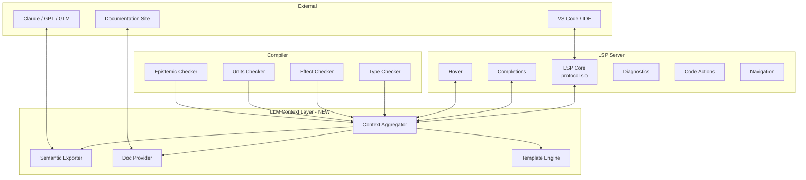
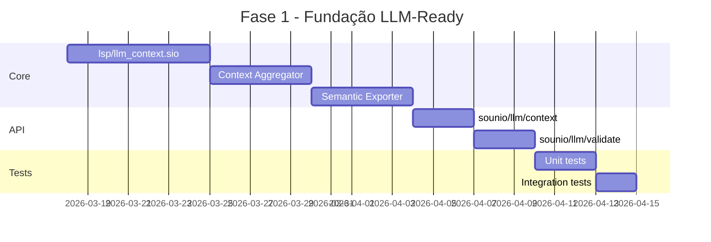
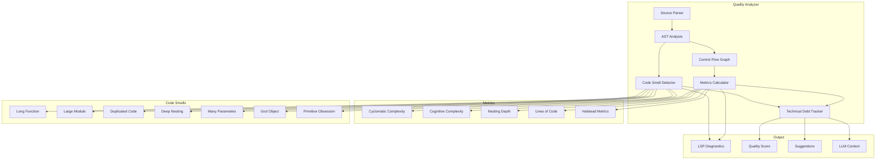
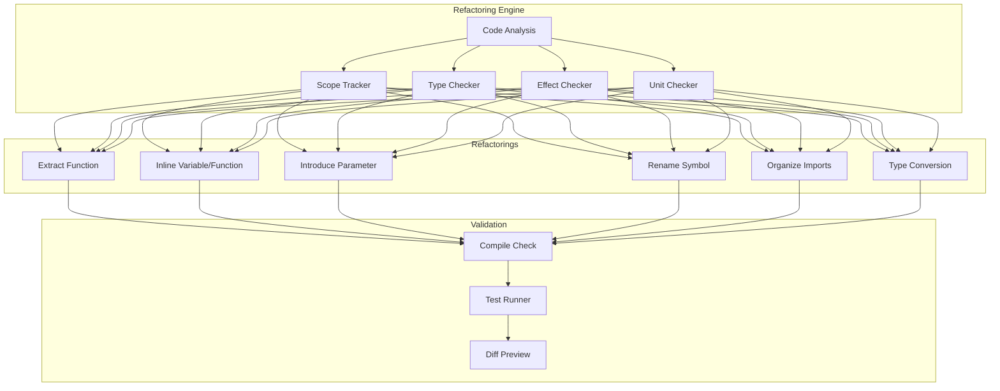
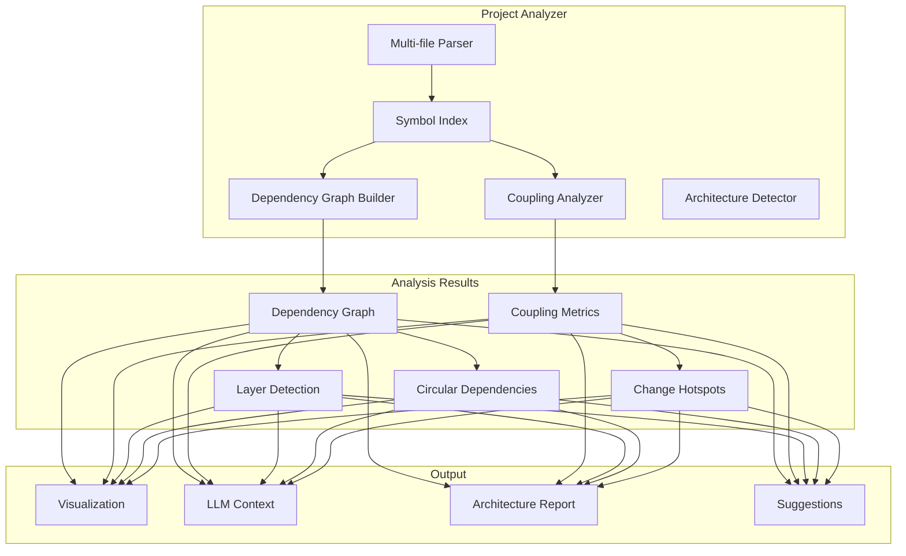

# Plano: LSP LLM-Ready para Sounio

**Objetivo**: Transformar o LSP do Sounio em uma ferramenta completa que guia LLMs e desenvolvedores para programar com perfeição e qualidade.

**Data**: 2026-03-17
**Autor**: Arquitetura GLM-5

---

## 1. Análise do Estado Atual

### 1.1 Módulos Existentes (~13K linhas total)

| Módulo | Linhas | Funcionalidade | Status |
|--------|--------|----------------|--------|
| [`protocol.sio`](../self-hosted/lsp/protocol.sio) | 1,176 | JSON-RPC, tipos base | ✅ Completo |
| [`completions.sio`](../self-hosted/lsp/completions.sio) | 2,798 | Auto-complete context-aware | ✅ Completo |
| [`hover.sio`](../self-hosted/lsp/hover.sio) | 3,913 | Type-on-hover, docs, signatures | ✅ Completo |
| [`diagnostics.sio`](../self-hosted/lsp/diagnostics.sio) | 1,203 | Erros/warnings/hints | ✅ Completo |
| [`code_actions.sio`](../self-hosted/lsp/code_actions.sio) | 1,275 | Quick fixes, refactorings | ✅ Completo |
| [`goto_def.sio`](../self-hosted/lsp/goto_def.sio) | 2,777 | Go to definition, references | ✅ Completo |
| [`rename.sio`](../self-hosted/lsp/rename.sio) | 1,542 | Rename symbol | ✅ Completo |

### 1.2 Capacidades Atuais

```
✅ Completions: keywords, vars, funcs, types, fields, modules
✅ Hover: type info, doc comments, effects, signatures
✅ Diagnostics: errors, warnings, info, hints
✅ Code Actions: add import, fix unused, add type annotation
✅ Navigation: go to def, find references
✅ Refactoring: rename symbol
```

### 1.3 Gaps Identificados para LLM-Readiness

| Gap | Impacto | Prioridade |
|-----|---------|------------|
| Semântica de efeitos não exposta | Alto | P0 |
| Contexto de unidades de medida | Alto | P0 |
| Contexto epistêmico (Knowledge<T>) | Alto | P0 |
| Snippets/Templates de código | Médio | P1 |
| Documentação inline rica | Médio | P1 |
| Semantic tokens | Médio | P1 |
| Call hierarchy | Baixo | P2 |
| Type hierarchy | Baixo | P2 |

---

## 2. Arquitetura Proposta

### 2.1 Visão Geral



### 2.2 Novo Módulo: `lsp/llm_context.sio`

Responsável por agregar contexto semântico rico e exportar em formato amigável para LLMs.

```sio
// lsp/llm_context.sio
// 
// Aggregates semantic context for LLM consumption.
// Exports structured context including types, effects, units, epistemic info.

struct LspLlmContext {
    // Symbol table snapshot
    symbols: [LspLlmSymbol; 4096],
    symbol_count: i64,
    
    // Type information
    types: [LspLlmType; 1024],
    type_count: i64,
    
    // Effect tracking
    effects: [LspLlmEffect; 256],
    effect_count: i64,
    
    // Units of measure
    units: [LspLlmUnit; 128],
    unit_count: i64,
    
    // Epistemic context (Knowledge<T>, uncertainty)
    epistemic: [LspLlmEpistemic; 64],
    epistemic_count: i64,
    
    // Current scope chain
    scope_chain: [i64; 32],
    scope_depth: i64,
}

struct LspLlmSymbol {
    name: string,
    kind: LspLlmSymbolKind,
    type_sig: string,
    doc_summary: string,
    effects: [string; 8],
    unit: string,
    confidence: f64,  // for epistemic types
    source_loc: LspLocation,
}

enum LspLlmSymbolKind {
    LlmSymFunction,
    LlmSymVariable,
    LlmSymType,
    LlmSymModule,
    LlmSymField,
    LlmSymEffect,
    LlmSymUnit,
    LlmSymKnowledge,
}

struct LspLlmType {
    name: string,
    kind: LspLlmTypeKind,
    fields: [LspLlmField; 32],
    field_count: i64,
    methods: [LspLlmMethod; 16],
    method_count: i64,
    doc: string,
}

struct LspLlmEffect {
    name: string,
    operations: [string; 8],
    handler_available: bool,
    doc: string,
}

struct LspLlmUnit {
    name: string,
    base_units: [string; 4],
    exponents: [i64; 4],
    doc: string,
}

struct LspLlmEpistemic {
    var_name: string,
    inner_type: string,
    confidence: f64,
    provenance: string,
    uncertainty_kind: LspLlmUncertaintyKind,
}

enum LspLlmUncertaintyKind {
    UncertaintyGaussian,
    UncertaintyPoisson,
    UncertaintyUniform,
    UncertaintyUnknown,
}
```

### 2.3 Novo Módulo: `lsp/templates.sio`

Fornece templates/snippets para padrões comuns de código Sounio.

```sio
// lsp/templates.sio
//
// Code templates for common Sounio patterns.

struct LspTemplate {
    name: string,
    description: string,
    category: LspTemplateCategory,
    trigger: string,  // prefix that triggers the template
    body: string,     // template body with $1, $2 placeholders
    scope: LspTemplateScope,
}

enum LspTemplateCategory {
    TemplateFunction,
    TemplateStruct,
    TemplateEffect,
    TemplateHandler,
    TemplateKnowledge,
    TemplateUnits,
    TemplateMatch,
    TemplateGpu,
}

enum LspTemplateScope {
    ScopeTopLevel,
    ScopeFunction,
    ScopeExpression,
    ScopeType,
}

// Template registry
let TEMPLATES: [LspTemplate; 64] = [
    // Function with effects
    LspTemplate {
        name: "fn_with_effects",
        description: "Function with effect annotation",
        category: TemplateFunction,
        trigger: "fnw",
        body: "fn $1($2) -> $3 with $4 {\n    $5\n}",
        scope: ScopeTopLevel,
    },
    // Effect definition
    LspTemplate {
        name: "effect_def",
        description: "Define an algebraic effect",
        category: TemplateEffect,
        trigger: "eff",
        body: "effect $1 {\n    $2\n}",
        scope: ScopeTopLevel,
    },
    // Effect handler
    LspTemplate {
        name: "handler_def",
        description: "Handle an effect",
        category: TemplateHandler,
        trigger: "handle",
        body: "handle $1 {\n    $2 => $3\n}",
        scope: ScopeExpression,
    },
    // Knowledge type
    LspTemplate {
        name: "knowledge_var",
        description: "Variable with epistemic type",
        category: TemplateKnowledge,
        trigger: "know",
        body: "let $1: Knowledge<$2> = Knowledge::from($3, $4);",
        scope: ScopeFunction,
    },
    // Units annotation
    LspTemplate {
        name: "units_let",
        description: "Variable with units",
        category: TemplateUnits,
        trigger: "ulet",
        body: "let $1: $2 with units $3 = $4;",
        scope: ScopeFunction,
    },
    // Match expression
    LspTemplate {
        name: "match_expr",
        description: "Pattern match expression",
        category: TemplateMatch,
        trigger: "match",
        body: "match $1 {\n    $2 => $3,\n    _ => $4,\n}",
        scope: ScopeExpression,
    },
    // GPU kernel
    LspTemplate {
        name: "gpu_kernel",
        description: "GPU kernel function",
        category: TemplateGpu,
        trigger: "kernel",
        body: "fn $1($2) -> $3 with GPU {\n    gpu::launch($4, $5, || {\n        $6\n    })\n}",
        scope: ScopeTopLevel,
    },
]
```

### 2.4 Novo Módulo: `lsp/semantic_tokens.sio`

Implementa semantic tokens para highlighting rico de código.

```sio
// lsp/semantic_tokens.sio
//
// LSP semantic tokens provider for Sounio.
// Enables rich syntax highlighting based on semantic information.

struct LspSemanticToken {
    line: i64,
    col: i64,
    length: i64,
    token_type: i64,
    modifiers: i64,
}

// Token types (LSP standard + Sounio-specific)
let SEMANTIC_TOKEN_FUNCTION: i64 = 0
let SEMANTIC_TOKEN_VARIABLE: i64 = 1
let SEMANTIC_TOKEN_PARAMETER: i64 = 2
let SEMANTIC_TOKEN_TYPE: i64 = 3
let SEMANTIC_TOKEN_MODULE: i64 = 4
let SEMANTIC_TOKEN_EFFECT: i64 = 5      // Sounio-specific
let SEMANTIC_TOKEN_UNIT: i64 = 6        // Sounio-specific
let SEMANTIC_TOKEN_KNOWLEDGE: i64 = 7   // Sounio-specific
let SEMANTIC_TOKEN_MACRO: i64 = 8

// Token modifiers
let SEMANTIC_MOD_DECLARATION: i64 = 1
let SEMANTIC_MOD_DEFINITION: i64 = 2
let SEMANTIC_MOD_READONLY: i64 = 4
let SEMANTIC_MOD_STATIC: i64 = 8
let SEMANTIC_MOD_ASYNC: i64 = 16
let SEMANTIC_MOD_UNCERTAIN: i64 = 32    // for epistemic types
```

---

## 3. API de Contexto para LLM

### 3.1 Endpoint: `sounio/llm/context`

Retorna contexto semântico completo do arquivo atual.

**Request:**
```json
{
  "textDocument": { "uri": "file:///path/to/file.sio" },
  "position": { "line": 10, "character": 5 },
  "contextDepth": 2
}
```

**Response:**
```json
{
  "symbols": [
    {
      "name": "parse_expr",
      "kind": "function",
      "signature": "fn parse_expr(tokens: &[Token]) -> Result<Expr, ParseError> with Mut, Panic",
      "doc": "Parses a single expression from the token stream.",
      "effects": ["Mut", "Panic"],
      "unit": null,
      "confidence": 1.0
    }
  ],
  "types": [
    {
      "name": "Expr",
      "kind": "struct",
      "fields": [
        { "name": "kind", "type": "ExprKind" },
        { "name": "span", "type": "Span" }
      ],
      "methods": ["is_literal", "is_binary"]
    }
  ],
  "effects": [
    {
      "name": "Mut",
      "operations": ["&mut", "var"],
      "handler_available": true
    }
  ],
  "units": [
    {
      "name": "m/s",
      "base_units": ["m", "s"],
      "exponents": [1, -1]
    }
  ],
  "epistemic": [
    {
      "var_name": "measurement",
      "inner_type": "f64",
      "confidence": 0.95,
      "provenance": "sensor_reading",
      "uncertainty_kind": "Gaussian"
    }
  ],
  "scope_chain": ["module", "fn main", "block"],
  "imports": ["std.io", "lexer::Token"],
  "suggestions": [
    "Consider adding error handling for parse_expr",
    "Effect Mut can be handled with handle Mut { ... }"
  ]
}
```

### 3.2 Endpoint: `sounio/llm/validate`

Valida código antes de aplicar mudanças.

**Request:**
```json
{
  "textDocument": { "uri": "file:///path/to/file.sio" },
  "newContent": "fn foo() -> i64 { 42 }",
  "checkEffects": true,
  "checkUnits": true,
  "checkEpistemic": true
}
```

**Response:**
```json
{
  "valid": true,
  "diagnostics": [],
  "effect_trace": ["Mut"],
  "unit_compatibility": null,
  "epistemic_propagation": null,
  "suggestions": [
    "Function foo has no effects - consider removing effect tracking"
  ]
}
```

### 3.3 Endpoint: `sounio/llm/examples`

Retorna exemplos de código para um conceito específico.

**Request:**
```json
{
  "concept": "effect_handler",
  "context": { "effect": "IO" }
}
```

**Response:**
```json
{
  "examples": [
    {
      "title": "Basic IO Handler",
      "code": "handle IO {\n    print(s) => println!(\"{}\", s),\n    read() => std::io::stdin().read_line()\n}",
      "explanation": "Handles IO effect by redirecting print to println and read to stdin."
    }
  ]
}
```

---

## 4. Integração com Documentação

### 4.1 Doc Comments Estruturados

```sio
/// Parses a Sounio source file into an AST.
/// 
/// # Parameters
/// - `source`: The source code as a string
/// - `path`: File path for error reporting
/// 
/// # Returns
/// `Result<Program, ParseError>` - The parsed program or an error
/// 
/// # Effects
/// - `Mut`: Mutates internal parser state
/// - `Panic`: Can panic on invalid UTF-8
/// 
/// # Example
/// ```sio
/// let result = parse_program(source, "main.sio");
/// match result {
///     Ok(prog) => compile(prog),
///     Err(e) => print_error(e),
/// }
/// ```
/// 
/// # See Also
/// - [`parse_expr`](self::parse_expr)
/// - [`tokenize`](lexer::tokenize)
fn parse_program(source: string, path: string) -> Result<Program, ParseError> with Mut, Panic {
    // ...
}
```

### 4.2 Hover Enriquecido

O hover deve mostrar:

```
fn parse_program(source: string, path: string) -> Result<Program, ParseError>
  with Mut, Panic

Parses a Sounio source file into an AST.

Effects:
  • Mut - Mutates internal parser state
  • Panic - Can panic on invalid UTF-8

Example:
  let result = parse_program(source, "main.sio");

See Also: parse_expr, tokenize
```

### 4.3 Integração com docs/

O LSP deve consumir a documentação em [`docs/`](../docs/):

| Documentação | Uso no LSP |
|--------------|------------|
| [`spec/LANGUAGE_SPECIFICATION.md`](../spec/LANGUAGE_SPECIFICATION.md) | Validação de sintaxe |
| [`docs/reference/STDLIB_REFERENCE.md`](../docs/stdlib/STDLIB_REFERENCE.md) | Completions de stdlib |
| [`docs/reference/KNOWLEDGE_REFERENCE.md`](../docs/reference/KNOWLEDGE_REFERENCE.md) | Contexto epistêmico |
| [`docs/guide/tutorial.md`](../docs/guide/tutorial.md) | Exemplos para LLM |
| [`docs/compiler/EFFECT_SYSTEM_ARCHITECTURE.md`](../docs/compiler/EFFECT_SYSTEM_ARCHITECTURE.md) | Documentação de efeitos |
| [`docs/compiler/UNIT_RUNTIME_CHECKING.md`](../docs/compiler/UNIT_RUNTIME_CHECKING.md) | Documentação de unidades |

---

## 5. Roadmap de Implementação

### Fase 1: Fundação LLM-Ready (P0)



**Entregáveis:**
- [ ] `lsp/llm_context.sio` - Context aggregator
- [ ] Endpoint `sounio/llm/context`
- [ ] Endpoint `sounio/llm/validate`
- [ ] Integração com type checker
- [ ] Integração com effect checker
- [ ] Integração com units checker
- [ ] Testes unitários

### Fase 2: Templates e Snippets (P1)

**Entregáveis:**
- [ ] `lsp/templates.sio` - Template engine
- [ ] Templates para: fn, struct, enum, effect, handler, knowledge, units, match, gpu
- [ ] Integração com completions
- [ ] Endpoint `sounio/llm/examples`

### Fase 3: Semantic Tokens (P1)

**Entregáveis:**
- [ ] `lsp/semantic_tokens.sio`
- [ ] Token types: function, variable, type, module, effect, unit, knowledge
- [ ] Token modifiers: declaration, readonly, async, uncertain
- [ ] Integração com VS Code

### Fase 4: Documentação Rica (P1)

**Entregáveis:**
- [ ] Parser para doc comments estruturados
- [ ] Hover enriquecido com examples, effects, see-also
- [ ] Integração com docs/ markdown
- [ ] Indexação de documentação para busca

### Fase 5: Features Avançadas (P2)

**Entregáveis:**
- [ ] Call hierarchy
- [ ] Type hierarchy
- [ ] Inlay hints (types, effects)
- [ ] Code lenses (run tests, show coverage)

---

## 6. Critérios de Aceitação

### 6.1 Para LLMs

| Critério | Métrica | Target |
|----------|---------|--------|
| Contexto completo | % de símbolos cobertos | 95% |
| Efeitos expostos | % de efeitos documentados | 100% |
| Unidades expostas | % de unidades documentadas | 100% |
| Epistêmico exposto | % de Knowledge<T> rastreado | 90% |
| Latência de contexto | ms para resposta | < 100ms |

### 6.2 Para Desenvolvedores

| Critério | Métrica | Target |
|----------|---------|--------|
| Completions úteis | % aceitas pelo usuário | 70% |
| Hover informativo | % com doc completa | 80% |
| Code actions corretos | % que compilam | 95% |
| Templates úteis | % usados | 50% |

---

## 7. Exemplo de Uso por LLM

### 7.1 Prompt do Desenvolvedor

```
User: Implemente uma função que lê um arquivo e retorna o conteúdo
      com incerteza de medição do tempo de leitura.
```

### 7.2 LLM consulta o LSP

```json
// Request: sounio/llm/context
{
  "concept": "file_io_with_uncertainty",
  "required_effects": ["IO", "Mut"],
  "required_types": ["Knowledge<f64>"],
  "language_features": ["units"]
}
```

### 7.3 LSP Responde

```json
{
  "templates": [
    {
      "name": "fn_with_effects_and_knowledge",
      "body": "fn $1($2) -> Knowledge<$3> with $4 {\n    let start = time_now();\n    let result = $5;\n    let elapsed = time_now() - start;\n    Knowledge::from(result, uncertainty_from_elapsed(elapsed))\n}"
    }
  ],
  "examples": [
    {
      "code": "fn read_with_timing(path: string) -> Knowledge<string> with IO, Mut {\n    let start = std::time::now();\n    let content = std::fs::read_to_string(path)?;\n    let elapsed = std::time::now() - start;\n    let uncertainty = elapsed as f64 * 0.001;  // 0.1% per ms\n    Knowledge::from(content, uncertainty)\n}"
    }
  ],
  "effects": [
    { "name": "IO", "doc": "Input/output operations" },
    { "name": "Mut", "doc": "Mutable state" }
  ],
  "types": [
    { "name": "Knowledge<T>", "doc": "Epistemic type representing uncertain knowledge" }
  ],
  "suggestions": [
    "Use Knowledge::from(value, confidence) to create uncertain values",
    "Handle IO effect with handle IO { ... }"
  ]
}
```

### 7.4 LLM Gera Código Correto

```sio
/// Reads a file and returns its content with timing uncertainty.
/// 
/// # Effects
/// - `IO`: File system access
/// - `Mut`: Time measurement state
/// 
/// # Returns
/// `Knowledge<string>` with content and confidence based on read time
fn read_file_with_uncertainty(path: string) -> Knowledge<string> with IO, Mut {
    let start = std::time::now_ms();
    let content = std::fs::read_to_string(path);
    let elapsed = std::time::now_ms() - start;
    
    // Confidence decreases with longer read times
    let confidence = 1.0 - (elapsed as f64 * 0.0001);
    
    Knowledge::from(content, confidence)
}
```

---

## 8. Análise de Qualidade de Código

### 8.1 Visão Geral

O LSP deve fornecer análise contínua de qualidade para guiar desenvolvedores e LLMs a escrever código maintainable.



### 8.2 Novo Módulo: `lsp/quality.sio`

```sio
// lsp/quality.sio
//
// Code quality analyzer for Sounio.
// Calculates metrics, detects code smells, and tracks technical debt.

// ============================================================================
// METRICS
// ============================================================================

struct LspQualityMetrics {
    // Cyclomatic Complexity - McCabe
    cyclomatic_complexity: i64,
    
    // Cognitive Complexity - SonarSource
    cognitive_complexity: i64,
    
    // Nesting depth
    max_nesting_depth: i64,
    
    // Lines of code
    loc_total: i64,
    loc_code: i64,
    loc_comment: i64,
    loc_blank: i64,
    
    // Function metrics
    fn_count: i64,
    fn_avg_length: i64,
    fn_max_length: i64,
    fn_avg_params: i64,
    fn_max_params: i64,
    
    // Halstead metrics
    halstead_volume: f64,
    halstead_difficulty: f64,
    halstead_effort: f64,
    
    // Maintainability index
    maintainability_index: f64,
}

// ============================================================================
// CODE SMELLS
// ============================================================================

enum LspCodeSmellKind {
    SmellLongFunction,        // Function too long
    SmellLargeModule,         // Module too large
    SmellDeepNesting,         // Too many nested blocks
    SmellManyParameters,      // Too many function parameters
    SmellDuplicatedCode,      // Potential code duplication
    SmellGodObject,           // Struct with too many responsibilities
    SmellPrimitiveObsession,  // Overuse of primitive types
    SmellDeadCode,            // Unreachable code
    SmellUnusedImport,        // Import not used
    SmellMagicNumber,         // Magic number without constant
    SmellEmptyBlock,          // Empty block without comment
    SmellLongParameterList,   // Parameter list too long
    SmellFeatureEnvy,         // Function uses another struct more than its own
    SmellDataClump,           // Group of data items that always appear together
}

struct LspCodeSmell {
    kind: LspCodeSmellKind,
    severity: i64,           // 1=info, 2=warning, 3=error
    location: LspRange,
    message: string,
    suggestion: string,
    debt_minutes: i64,       // Estimated time to fix
}

// ============================================================================
// TECHNICAL DEBT
// ============================================================================

struct LspTechnicalDebt {
    total_debt_minutes: i64,
    smell_count: i64,
    critical_count: i64,
    major_count: i64,
    minor_count: i64,
    debt_ratio: f64,         // debt / debt + development_time
    quality_rating: i64,     // 1=A, 2=B, 3=C, 4=D, 5=E, 6=F
}

// ============================================================================
// QUALITY CONTEXT
// ============================================================================

struct LspQualityContext {
    metrics: LspQualityMetrics,
    smells: [LspCodeSmell; 256],
    smell_count: i64,
    debt: LspTechnicalDebt,
    file_path: string,
    last_analyzed: i64,      // timestamp
}

// ============================================================================
// THRESHOLDS - configurable
// ============================================================================

let QUALITY_MAX_FN_LENGTH: i64 = 50       // lines
let QUALITY_MAX_FN_PARAMS: i64 = 5
let QUALITY_MAX_NESTING: i64 = 4
let QUALITY_MAX_CYCLOMATIC: i64 = 10
let QUALITY_MAX_COGNITIVE: i64 = 15
let QUALITY_MAX_MODULE_LOC: i64 = 500
let QUALITY_MIN_MAINTAINABILITY: f64 = 20.0
```

### 8.3 Code Smells Específicos de Sounio

Além dos code smells tradicionais, o LSP deve detectar problemas específicos de Sounio:

| Smell | Descrição | Exemplo | Sugestão |
|-------|-----------|---------|----------|
| **Unhandled Effect** | Função com efeito não tratado | `fn foo() with IO { ... }` sem handler | Adicionar handler ou propagar |
| **Effect Overload** | Função com muitos efeitos | `fn foo() with IO, Mut, Panic, GPU, Async` | Dividir em funções menores |
| **Unit Confusion** | Operação entre unidades incompatíveis | `let x: meters = y: seconds` | Verificar conversão |
| **Knowledge Loss** | Knowledge convertido para T sem propagação | `let x: f64 = k.value` | Usar `k.unwrap_with_uncertainty()` |
| **Unnecessary Uncertainty** | Knowledge com confidence=1.0 sempre | `Knowledge::from(x, 1.0)` | Usar tipo simples |
| **Missing Provenance** | Knowledge sem origem documentada | `Knowledge::from(x, 0.9)` sem source | Adicionar provenance |
| **GPU Kernel Too Large** | Kernel com muitas operações | Kernel com 100+ linhas | Dividir em múltiplos kernels |
| **Match Exhaustiveness** | Match não exaustivo | `match x { A => ... }` sem default | Adicionar casos faltantes |

### 8.4 API para LLM: `sounio/llm/quality`

**Request:**
```json
{
  "textDocument": { "uri": "file:///path/to/file.sio" },
  "includeMetrics": true,
  "includeSmells": true,
  "includeDebt": true,
  "severityThreshold": 2
}
```

**Response:**
```json
{
  "metrics": {
    "cyclomatic_complexity": 12,
    "cognitive_complexity": 18,
    "max_nesting_depth": 5,
    "loc_code": 150,
    "fn_count": 8,
    "fn_avg_length": 18,
    "maintainability_index": 42.5
  },
  "smells": [
    {
      "kind": "DeepNesting",
      "severity": 2,
      "message": "Function process_data has nesting depth 5 - max recommended: 4",
      "suggestion": "Extract nested logic into separate functions",
      "debt_minutes": 15
    },
    {
      "kind": "ManyParameters",
      "severity": 1,
      "message": "Function compile has 7 parameters - max recommended: 5",
      "suggestion": "Group related parameters into a struct",
      "debt_minutes": 10
    }
  ],
  "debt": {
    "total_debt_minutes": 45,
    "smell_count": 3,
    "quality_rating": 2,
    "rating_letter": "B"
  },
  "suggestions": [
    "Refactor process_data to reduce nesting - this would improve cognitive complexity by 8 points",
    "Create a CompileOptions struct to group the 7 parameters of compile"
  ]
}
```

### 8.5 Quality Gates para CI/CD

```sio
/// Quality gate configuration
struct LspQualityGate {
    // Fail if any condition is violated
    max_cyclomatic: i64,           // default: 15
    max_cognitive: i64,            // default: 20
    max_nesting: i64,              // default: 5
    max_fn_length: i64,            // default: 60
    max_params: i64,               // default: 6
    min_maintainability: f64,      // default: 20.0
    max_debt_ratio: f64,           // default: 0.10 - 10%
    min_quality_rating: i64,       // default: 3 - C or better
    block_critical_smells: bool,   // default: true
}

/// Check if code passes quality gate
fn quality_gate_check(ctx: LspQualityContext, gate: LspQualityGate) -> LspQualityGateResult {
    var result: LspQualityGateResult
    result.passed = true
    
    if ctx.metrics.cyclomatic_complexity > gate.max_cyclomatic {
        result.passed = false
        result.violations[result.violation_count] = "Cyclomatic complexity exceeds threshold"
        result.violation_count = result.violation_count + 1
    }
    
    if ctx.debt.quality_rating > gate.min_quality_rating {
        result.passed = false
        result.violations[result.violation_count] = "Quality rating below threshold"
        result.violation_count = result.violation_count + 1
    }
    
    result
}
```

---

## 9. Refatorações Avançadas

### 9.1 Visão Geral

O LSP deve fornecer refatorações automatizadas que preservam semântica e guiam LLMs e desenvolvedores a melhorar a qualidade do código.



### 9.2 Novo Módulo: `lsp/refactor.sio`

```sio
// lsp/refactor.sio
//
// Advanced refactoring operations for Sounio.
// All refactorings preserve semantics, effects, and units.

// ============================================================================
// REFACTORING TYPES
// ============================================================================

enum LspRefactorKind {
    RefactorExtractFunction,
    RefactorExtractVariable,
    RefactorInlineVariable,
    RefactorInlineFunction,
    RefactorIntroduceParameter,
    RefactorConvertToStruct,
    RefactorConvertToEnum,
    RefactorAddEffectHandler,
    RefactorWrapInKnowledge,
    RefactorUnwrapKnowledge,
    RefactorAddUnits,
    RefactorConvertUnits,
    RefactorOrganizeImports,
    RefactorRemoveUnusedImports,
}

struct LspRefactoring {
    kind: LspRefactorKind,
    title: string,
    description: string,
    edits: [LspRefactorEdit; 64],
    edit_count: i64,
    cursor_position: LspPosition,
    is_preferred: bool,
}

struct LspRefactorEdit {
    file_id: i64,
    range: LspRange,
    new_text: string,
    edit_kind: LspRefactorEditKind,
}

enum LspRefactorEditKind {
    EditInsert,
    EditDelete,
    EditReplace,
}

// ============================================================================
// REFACTORING CONTEXT
// ============================================================================

struct LspRefactorContext {
    // Source code
    source: string,
    file_id: i64,
    
    // Selection
    selection_start: LspPosition,
    selection_end: LspPosition,
    
    // Analysis results
    scope: LspScopeInfo,
    type_info: LspTypeInfo,
    effects: [string; 16],
    effect_count: i64,
    units: string,
    
    // Target name for extract/rename
    suggested_name: string,
}

struct LspScopeInfo {
    // Variables in scope
    vars: [LspVarInfo; 256],
    var_count: i64,
    
    // Functions in scope
    funcs: [LspFuncInfo; 128],
    func_count: i64,
    
    // Current function
    current_fn: string,
    current_fn_effects: [string; 8],
    current_fn_effect_count: i64,
}

struct LspTypeInfo {
    expr_type: string,
    is_generic: bool,
    is_epistemic: bool,
    epistemic_confidence: f64,
}

struct LspVarInfo {
    name: string,
    type_name: string,
    is_mutable: bool,
    is_used: bool,
    definition_line: i64,
}

struct LspFuncInfo {
    name: string,
    signature: string,
    effects: [string; 8],
    effect_count: i64,
}
```

### 9.3 Extract Function

```sio
/// Extract selected code into a new function
///
/// Steps:
/// 1. Analyze selected expression(s)
/// 2. Identify free variables (become parameters)
/// 3. Infer return type and effects
/// 4. Generate new function signature
/// 5. Replace selection with function call
/// 6. Insert new function at appropriate scope

fn refactor_extract_function(ctx: LspRefactorContext) -> LspRefactoring with Mut {
    var result: LspRefactoring
    result.kind = RefactorExtractFunction
    
    // 1. Parse selected code
    let selected_code = extract_selection(ctx.source, ctx.selection_start, ctx.selection_end)
    let expr = parse_expression(selected_code)
    
    // 2. Find free variables
    var free_vars: [LspVarInfo; 64]
    var free_var_count: i64 = 0
    find_free_variables(expr, ctx.scope.vars, ctx.scope.var_count, free_vars, free_var_count)
    
    // 3. Infer type and effects
    let return_type = infer_type(expr, ctx.type_info)
    var effects: [string; 16]
    var effect_count: i64 = 0
    infer_effects(expr, ctx.scope, effects, effect_count)
    
    // 4. Generate function name
    let fn_name = suggest_function_name(expr, ctx.suggested_name)
    
    // 5. Build function signature
    var params: string = ""
    var i: i64 = 0
    while i < free_var_count {
        if i > 0 { params = params + ", " }
        params = params + free_vars[i].name + ": " + free_vars[i].type_name
        i = i + 1
    }
    
    var effect_ann: string = ""
    if effect_count > 0 {
        effect_ann = " with "
        var j: i64 = 0
        while j < effect_count {
            if j > 0 { effect_ann = effect_ann + ", " }
            effect_ann = effect_ann + effects[j]
            j = j + 1
        }
    }
    
    let signature = "fn " + fn_name + "(" + params + ") -> " + return_type + effect_ann
    let new_fn = signature + " {\n    " + selected_code + "\n}"
    
    // 6. Build call site
    var call: string = fn_name + "("
    i = 0
    while i < free_var_count {
        if i > 0 { call = call + ", " }
        call = call + free_vars[i].name
        i = i + 1
    }
    call = call + ")"
    
    // 7. Create edits
    // Edit 1: Replace selection with call
    result.edits[result.edit_count] = LspRefactorEdit {
        file_id: ctx.file_id,
        range: make_range(ctx.selection_start, ctx.selection_end),
        new_text: call,
        edit_kind: EditReplace,
    }
    result.edit_count = result.edit_count + 1
    
    // Edit 2: Insert new function after current function
    let insert_pos = find_insert_position(ctx)
    result.edits[result.edit_count] = LspRefactorEdit {
        file_id: ctx.file_id,
        range: make_range(insert_pos, insert_pos),
        new_text: "\n\n" + new_fn,
        edit_kind: EditInsert,
    }
    result.edit_count = result.edit_count + 1
    
    result.title = "Extract to function: " + fn_name
    result.description = "Extract selected code into a new function with "
                       + int_to_string(free_var_count) + " parameters"
    result.is_preferred = true
    
    result
}
```

### 9.4 Inline Variable

```sio
/// Inline a variable - replace all uses with the initializer
///
/// Steps:
/// 1. Find variable definition
/// 2. Get initializer expression
/// 3. Find all uses of the variable
/// 4. Replace uses with initializer (with parens if needed)
/// 5. Remove the variable definition

fn refactor_inline_variable(ctx: LspRefactorContext) -> LspRefactoring with Mut {
    var result: LspRefactoring
    result.kind = RefactorInlineVariable
    
    // 1. Find the variable being inlined
    let var_name = get_identifier_at(ctx.source, ctx.selection_start)
    let var_def = find_variable_definition(ctx.scope, var_name)
    
    // 2. Get the initializer
    let initializer = extract_initializer(ctx.source, var_def)
    let needs_parens = expression_needs_parens(initializer)
    
    var replacement: string = initializer
    if needs_parens {
        replacement = "(" + initializer + ")"
    }
    
    // 3. Find all uses
    var uses: [LspPosition; 256]
    var use_count: i64 = 0
    find_variable_uses(ctx.source, var_name, uses, use_count)
    
    // 4. Create edits for each use (in reverse order to preserve positions)
    var i: i64 = use_count - 1
    while i >= 0 {
        result.edits[result.edit_count] = LspRefactorEdit {
            file_id: ctx.file_id,
            range: make_range_at(uses[i], var_name.len()),
            new_text: replacement,
            edit_kind: EditReplace,
        }
        result.edit_count = result.edit_count + 1
        i = i - 1
    }
    
    // 5. Remove the definition
    let def_range = find_definition_range(ctx.source, var_def)
    result.edits[result.edit_count] = LspRefactorEdit {
        file_id: ctx.file_id,
        range: def_range,
        new_text: "",
        edit_kind: EditDelete,
    }
    result.edit_count = result.edit_count + 1
    
    result.title = "Inline variable: " + var_name
    result.description = "Replace all uses of " + var_name + " with its initializer"
    
    result
}
```

### 9.5 Introduce Parameter

```sio
/// Convert a local variable or literal to a function parameter
///
/// Steps:
/// 1. Identify the expression to parameterize
/// 2. Add parameter to function signature
/// 3. Replace expression with parameter reference
/// 4. Update all call sites with the argument

fn refactor_introduce_parameter(ctx: LspRefactorContext) -> LspRefactoring with Mut {
    var result: LspRefactoring
    result.kind = RefactorIntroduceParameter
    
    // 1. Get the expression to parameterize
    let expr = get_expression_at(ctx.source, ctx.selection_start)
    let expr_type = infer_type(expr, ctx.type_info)
    let param_name = ctx.suggested_name
    
    // 2. Find the enclosing function
    let fn_info = ctx.scope.current_fn
    let fn_sig = find_function_signature(ctx.source, fn_info)
    
    // 3. Add parameter to signature
    let new_sig = add_parameter_to_signature(fn_sig, param_name, expr_type)
    
    // Edit 1: Update function signature
    result.edits[result.edit_count] = LspRefactorEdit {
        file_id: ctx.file_id,
        range: fn_sig.range,
        new_text: new_sig,
        edit_kind: EditReplace,
    }
    result.edit_count = result.edit_count + 1
    
    // 4. Replace expression with parameter reference
    result.edits[result.edit_count] = LspRefactorEdit {
        file_id: ctx.file_id,
        range: make_range(ctx.selection_start, ctx.selection_end),
        new_text: param_name,
        edit_kind: EditReplace,
    }
    result.edit_count = result.edit_count + 1
    
    // 5. Update all call sites
    var calls: [LspPosition; 128]
    var call_count: i64 = 0
    find_function_calls(ctx.source, fn_info, calls, call_count)
    
    var i: i64 = 0
    while i < call_count {
        let call_range = make_range_at(calls[i], 0)
        let new_call = add_argument_to_call(ctx.source, calls[i], expr)
        
        result.edits[result.edit_count] = LspRefactorEdit {
            file_id: ctx.file_id,
            range: call_range,
            new_text: new_call,
            edit_kind: EditReplace,
        }
        result.edit_count = result.edit_count + 1
        i = i + 1
    }
    
    result.title = "Introduce parameter: " + param_name
    result.description = "Add " + param_name + ": " + expr_type + " to function parameters"
    
    result
}
```

### 9.6 Refatorações Específicas de Sounio

#### Wrap in Knowledge<T>

```sio
/// Wrap an expression in Knowledge<T> type
///
/// Before:
///   let measurement = sensor.read()
///
/// After:
///   let measurement: Knowledge<f64> = Knowledge::from(sensor.read(), 0.95)
///     .with_provenance("sensor.read()")

fn refactor_wrap_in_knowledge(ctx: LspRefactorContext) -> LspRefactoring with Mut {
    var result: LspRefactoring
    result.kind = RefactorWrapInKnowledge
    
    let expr = get_expression_at(ctx.source, ctx.selection_start)
    let expr_type = infer_type(expr, ctx.type_info)
    
    // Wrap in Knowledge::from with placeholder confidence
    let wrapped = "Knowledge::from(" + expr + ", 0.95).with_provenance(\"TODO: add source\")"
    
    // Add type annotation
    let type_ann = "Knowledge<" + expr_type + ">"
    
    result.edits[result.edit_count] = LspRefactorEdit {
        file_id: ctx.file_id,
        range: make_range(ctx.selection_start, ctx.selection_end),
        new_text: wrapped,
        edit_kind: EditReplace,
    }
    result.edit_count = result.edit_count + 1
    
    result.title = "Wrap in Knowledge<" + expr_type + ">"
    result.description = "Convert to epistemic type with uncertainty tracking"
    
    result
}
```

#### Add Effect Handler

```sio
/// Wrap expression in effect handler
///
/// Before:
///   let result = risky_operation()
///
/// After:
///   let result = handle RiskEffect {
///     risky_operation() => ...
///   } in {
///     risky_operation()
///   }

fn refactor_add_effect_handler(ctx: LspRefactorContext) -> LspRefactoring with Mut {
    var result: LspRefactoring
    result.kind = RefactorAddEffectHandler
    
    let expr = get_expression_at(ctx.source, ctx.selection_start)
    
    // Identify effects used by the expression
    var effects: [string; 8]
    var effect_count: i64 = 0
    infer_effects(expr, ctx.scope, effects, effect_count)
    
    // Generate handler skeleton
    var handler: string = "handle "
    var i: i64 = 0
    while i < effect_count {
        if i > 0 { handler = handler + ", " }
        handler = handler + effects[i]
        i = i + 1
    }
    handler = handler + " {\n"
    handler = handler + "    // TODO: add effect handlers\n"
    handler = handler + "} in {\n"
    handler = handler + "    " + expr + "\n"
    handler = handler + "}"
    
    result.edits[result.edit_count] = LspRefactorEdit {
        file_id: ctx.file_id,
        range: make_range(ctx.selection_start, ctx.selection_end),
        new_text: handler,
        edit_kind: EditReplace,
    }
    result.edit_count = result.edit_count + 1
    
    result.title = "Add effect handler"
    result.description = "Wrap in handler for: " + join_effects(effects, effect_count)
    
    result
}
```

### 9.7 API para LLM: `sounio/llm/refactor`

**Request:**
```json
{
  "textDocument": { "uri": "file:///path/to/file.sio" },
  "range": {
    "start": { "line": 10, "character": 5 },
    "end": { "line": 15, "character": 20 }
  },
  "refactorKind": "extract_function",
  "options": {
    "suggestedName": "calculate_total",
    "preserveEffects": true,
    "preserveUnits": true
  }
}
```

**Response:**
```json
{
  "refactoring": {
    "kind": "extract_function",
    "title": "Extract to function: calculate_total",
    "description": "Extract selected code into a new function with 2 parameters",
    "edits": [
      {
        "range": { "start": { "line": 10, "character": 5 }, "end": { "line": 15, "character": 20 } },
        "newText": "calculate_total(items, tax_rate)"
      },
      {
        "range": { "start": { "line": 50, "character": 0 }, "end": { "line": 50, "character": 0 } },
        "newText": "\n\nfn calculate_total(items: &[Item], tax_rate: f64) -> f64 with Mut {\n    // extracted code\n}"
      }
    ],
    "preview": {
      "before": "// original code...",
      "after": "// refactored code..."
    }
  },
  "validation": {
    "compiles": true,
    "effects_preserved": true,
    "units_preserved": true,
    "tests_pass": null
  }
}
```

---

## 10. Project Intelligence

### 10.1 Visão Geral

O LSP deve fornecer inteligência de projeto para ajudar LLMs e desenvolvedores a entender a arquitetura, dependências e acoplamento do código.



### 10.2 Novo Módulo: `lsp/project.sio`

```sio
// lsp/project.sio
//
// Project intelligence: dependency graphs, coupling analysis, architecture detection.
// Helps LLMs and developers understand project structure.

// ============================================================================
// DEPENDENCY GRAPH
// ============================================================================

struct LspDependencyGraph {
    nodes: [LspDepNode; 1024],
    node_count: i64,
    edges: [LspDepEdge; 4096],
    edge_count: i64,
}

struct LspDepNode {
    id: i64,
    name: string,
    kind: LspDepNodeKind,
    file_path: string,
    line: i64,
    metrics: LspNodeMetrics,
}

enum LspDepNodeKind {
    NodeModule,
    NodeFunction,
    NodeStruct,
    NodeEnum,
    NodeTrait,
    NodeType,
    NodeEffect,
    NodeUnit,
}

struct LspDepEdge {
    from_id: i64,
    to_id: i64,
    kind: LspDepEdgeKind,
    weight: i64,  // number of usages
}

enum LspDepEdgeKind {
    EdgeImports,       // module imports
    EdgeCalls,         // function calls
    EdgeUses,          // type usage
    EdgeImplements,    // trait implementation
    EdgeExtends,       // struct extension
    EdgeHandles,       // effect handling
    EdgeConverts,      // unit conversion
}

struct LspNodeMetrics {
    fan_in: i64,       // number of incoming edges
    fan_out: i64,      // number of outgoing edges
    instability: f64,  // fan_out / fan_in + fan_out
    abstractness: f64, // abstract / total
}

// ============================================================================
// COUPLING ANALYSIS
// ============================================================================

struct LspCouplingReport {
    // Module-level coupling
    module_coupling: [LspModuleCoupling; 256],
    module_count: i64,
    
    // Function-level coupling
    function_coupling: [LspFunctionCoupling; 1024],
    function_count: i64,
    
    // Problem areas
    tight_coupling: [LspCouplingIssue; 128],
    tight_count: i64,
    
    // Circular dependencies
    cycles: [LspDepCycle; 32],
    cycle_count: i64,
}

struct LspModuleCoupling {
    module_name: string,
    afferent: i64,     // incoming dependencies
    efferent: i64,     // outgoing dependencies
    instability: f64,  // efferent / afferent + efferent
    abstractness: f64,
    distance: f64,     // distance from main sequence
}

struct LspFunctionCoupling {
    function_name: string,
    module_name: string,
    calls_to: [string; 64],
    calls_to_count: i64,
    called_by: [string; 64],
    called_by_count: i64,
    data_coupling: i64,  // shared data structures
    stamp_coupling: i64, // shared type parameters
}

struct LspCouplingIssue {
    kind: LspCouplingIssueKind,
    severity: i64,
    modules: [string; 4],
    description: string,
    suggestion: string,
}

enum LspCouplingIssueKind {
    IssueTightCoupling,
    IssueCircularDependency,
    IssueGodModule,
    IssueFeatureEnvy,
    IssueInappropriateIntimacy,
    IssueMiddleMan,
}

struct LspDepCycle {
    nodes: [string; 16],
    node_count: i64,
    severity: i64,
}

// ============================================================================
// ARCHITECTURE DETECTION
// ============================================================================

struct LspArchitectureReport {
    detected_pattern: LspArchPattern,
    layers: [LspArchLayer; 16],
    layer_count: i64,
    violations: [LspArchViolation; 64],
    violation_count: i64,
    suggestions: [string; 32],
    suggestion_count: i64,
}

enum LspArchPattern {
    PatternLayered,      // UI -> Business -> Data
    PatternHexagonal,    // Ports and Adapters
    PatternMVVM,         // Model-View-ViewModel
    PatternMVC,          // Model-View-Controller
    PatternMicroservices,// Service boundaries
    PatternMonolith,     // Single deployable
    PatternUnknown,
}

struct LspArchLayer {
    name: string,
    modules: [string; 64],
    module_count: i64,
    allowed_dependencies: [string; 8],
    allowed_count: i64,
}

struct LspArchViolation {
    from_layer: string,
    to_layer: string,
    from_module: string,
    to_module: string,
    description: string,
}

// ============================================================================
// PROJECT CONTEXT
// ============================================================================

struct LspProjectContext {
    // Basic info
    root_path: string,
    file_count: i64,
    total_loc: i64,
    
    // Dependency graph
    graph: LspDependencyGraph,
    
    // Coupling analysis
    coupling: LspCouplingReport,
    
    // Architecture
    architecture: LspArchitectureReport,
    
    // Hotspots - files that change frequently
    hotspots: [LspHotspot; 64],
    hotspot_count: i64,
    
    // Entry points
    entry_points: [string; 16],
    entry_count: i64,
    
    // Public API
    public_api: [LspApiEntry; 512],
    api_count: i64,
}

struct LspHotspot {
    file_path: string,
    change_frequency: i64,
    bug_density: f64,
    complexity: i64,
    risk_score: f64,
}

struct LspApiEntry {
    name: string,
    kind: LspDepNodeKind,
    visibility: LspVisibility,
    signature: string,
    doc: string,
}

enum LspVisibility {
    VisibilityPublic,
    VisibilityModule,
    VisibilityPrivate,
}
```

### 10.3 Dependency Graph Analysis

```sio
/// Build dependency graph from project files
fn project_build_dependency_graph(files: [string; 1024], file_count: i64) -> LspDependencyGraph with Mut, IO {
    var graph: LspDependencyGraph
    
    // Phase 1: Create nodes for all symbols
    var i: i64 = 0
    while i < file_count {
        let source = read_file(files[i])
        let symbols = extract_symbols(source)
        
        var j: i64 = 0
        while j < symbols.count {
            graph.nodes[graph.node_count] = LspDepNode {
                id: graph.node_count,
                name: symbols[j].name,
                kind: symbols[j].kind,
                file_path: files[i],
                line: symbols[j].line,
                metrics: LspNodeMetrics { fan_in: 0, fan_out: 0, instability: 0.0, abstractness: 0.0 },
            }
            graph.node_count = graph.node_count + 1
            j = j + 1
        }
        i = i + 1
    }
    
    // Phase 2: Create edges for dependencies
    i = 0
    while i < file_count {
        let source = read_file(files[i])
        let deps = extract_dependencies(source)
        
        var j: i64 = 0
        while j < deps.count {
            let from_id = find_node_id(graph, deps[j].from_name)
            let to_id = find_node_id(graph, deps[j].to_name)
            
            if from_id >= 0 && to_id >= 0 {
                // Check if edge already exists
                let existing = find_edge(graph, from_id, to_id)
                if existing >= 0 {
                    graph.edges[existing].weight = graph.edges[existing].weight + 1
                } else {
                    graph.edges[graph.edge_count] = LspDepEdge {
                        from_id: from_id,
                        to_id: to_id,
                        kind: deps[j].kind,
                        weight: 1,
                    }
                    graph.edge_count = graph.edge_count + 1
                }
            }
            j = j + 1
        }
        i = i + 1
    }
    
    // Phase 3: Calculate metrics
    calculate_node_metrics(graph)
    
    graph
}

/// Detect circular dependencies using DFS
fn project_detect_cycles(graph: LspDependencyGraph) -> [LspDepCycle; 32] with Mut {
    var cycles: [LspDepCycle; 32]
    var cycle_count: i64 = 0
    
    var visited: [bool; 1024]
    var rec_stack: [bool; 1024]
    var path: [i64; 1024]
    var path_len: i64 = 0
    
    var i: i64 = 0
    while i < graph.node_count {
        if detect_cycle_dfs(graph, i, visited, rec_stack, path, path_len, cycles, cycle_count) {
            cycle_count = cycle_count + 1
        }
        i = i + 1
    }
    
    cycles
}
```

### 10.4 Coupling Analysis

```sio
/// Calculate coupling metrics for all modules
fn project_analyze_coupling(graph: LspDependencyGraph) -> LspCouplingReport with Mut {
    var report: LspCouplingReport
    
    // Calculate module-level coupling
    var modules: [string; 256]
    var module_count: i64 = 0
    extract_modules(graph, modules, module_count)
    
    var i: i64 = 0
    while i < module_count {
        var mc: LspModuleCoupling
        mc.module_name = modules[i]
        
        // Count afferent - incoming dependencies
        var j: i64 = 0
        while j < graph.edge_count {
            let to_module = get_module_for_node(graph, graph.edges[j].to_id)
            if to_module == modules[i] {
                mc.afferent = mc.afferent + 1
            }
            j = j + 1
        }
        
        // Count efferent - outgoing dependencies
        j = 0
        while j < graph.edge_count {
            let from_module = get_module_for_node(graph, graph.edges[j].from_id)
            if from_module == modules[i] {
                mc.efferent = mc.efferent + 1
            }
            j = j + 1
        }
        
        // Calculate instability
        let total = mc.afferent + mc.efferent
        if total > 0 {
            mc.instability = mc.efferent as f64 / total as f64
        }
        
        // Check for issues
        if mc.efferent > 20 {
            report.tight_coupling[report.tight_count] = LspCouplingIssue {
                kind: IssueGodModule,
                severity: 2,
                modules: [modules[i], "", "", ""],
                description: "Module has too many outgoing dependencies",
                suggestion: "Consider splitting into smaller, focused modules",
            }
            report.tight_count = report.tight_count + 1
        }
        
        report.module_coupling[report.module_count] = mc
        report.module_count = report.module_count + 1
        i = i + 1
    }
    
    // Detect cycles
    let cycles = project_detect_cycles(graph)
    var c: i64 = 0
    while c < 32 && cycles[c].node_count > 0 {
        report.cycles[report.cycle_count] = cycles[c]
        report.cycle_count = report.cycle_count + 1
        
        report.tight_coupling[report.tight_count] = LspCouplingIssue {
            kind: IssueCircularDependency,
            severity: 3,
            modules: cycles[c].nodes,
            description: "Circular dependency detected",
            suggestion: "Introduce interface or move shared code to separate module",
        }
        report.tight_count = report.tight_count + 1
        
        c = c + 1
    }
    
    report
}
```

### 10.5 API para LLM: `sounio/llm/project`

**Request:**
```json
{
  "rootUri": "file:///path/to/project",
  "includeGraph": true,
  "includeCoupling": true,
  "includeArchitecture": true,
  "maxDepth": 3
}
```

**Response:**
```json
{
  "project": {
    "file_count": 127,
    "total_loc": 15420,
    "entry_points": ["main.sio", "lib.sio"]
  },
  "graph": {
    "nodes": [
      {
        "name": "lexer::tokenize",
        "kind": "function",
        "file": "lexer/mod.sio",
        "metrics": {
          "fan_in": 15,
          "fan_out": 3,
          "instability": 0.17
        }
      }
    ],
    "edges": [
      {
        "from": "parser::parse",
        "to": "lexer::tokenize",
        "kind": "calls",
        "weight": 5
      }
    ]
  },
  "coupling": {
    "modules": [
      {
        "name": "parser",
        "afferent": 8,
        "efferent": 12,
        "instability": 0.6
      }
    ],
    "issues": [
      {
        "kind": "CircularDependency",
        "severity": 3,
        "modules": ["check::types", "check::infer", "check::types"],
        "suggestion": "Introduce interface to break cycle"
      }
    ]
  },
  "architecture": {
    "pattern": "Layered",
    "layers": [
      {
        "name": "frontend",
        "modules": ["lexer", "parser"]
      },
      {
        "name": "semantic",
        "modules": ["check", "resolve"]
      },
      {
        "name": "backend",
        "modules": ["ir", "native", "wasm"]
      }
    ],
    "violations": [
      {
        "from_layer": "backend",
        "to_layer": "frontend",
        "description": "backend/native calls frontend/parser directly"
      }
    ]
  },
  "suggestions": [
    "Break circular dependency between check::types and check::infer",
    "Reduce coupling in parser module - consider extracting utilities",
    "Fix architecture violation: backend should not depend on frontend"
  ]
}
```

### 10.6 Visualização de Dependências

O LSP pode gerar dados para visualização:

```sio
/// Export dependency graph as DOT format for Graphviz
fn project_export_dot(graph: LspDependencyGraph) -> string with Mut {
    var dot: string = "digraph dependencies {\n"
    dot = dot + "  rankdir=TB;\n"
    dot = dot + "  node [shape=box];\n\n"
    
    // Group by module
    dot = dot + "  // Nodes\n"
    var i: i64 = 0
    while i < graph.node_count {
        let node = graph.nodes[i]
        dot = dot + "  \"" + node.name + "\" [label=\"" + node.name + "\"];\n"
        i = i + 1
    }
    
    dot = dot + "\n  // Edges\n"
    i = 0
    while i < graph.edge_count {
        let edge = graph.edges[i]
        let from = graph.nodes[edge.from_id].name
        let to = graph.nodes[edge.to_id].name
        dot = dot + "  \"" + from + "\" -> \"" + to + "\" [weight=" + int_to_string(edge.weight) + "];\n"
        i = i + 1
    }
    
    dot = dot + "}\n"
    dot
}
```

---

## 11. Próximos Passos

1. **Revisar e aprovar este plano**
2. **Criar branch** `feature/lsp-llm-ready`
3. **Implementar Fase 1** - `lsp/llm_context.sio`
4. **Implementar Fase Quality** - `lsp/quality.sio`
5. **Implementar Fase Refactor** - `lsp/refactor.sio`
6. **Implementar Fase Project** - `lsp/project.sio`
7. **Testar com LLM real** (Claude, GPT)
8. **Iterar baseado em feedback**

---

## 12. Referências

- [LSP Specification 3.17](https://microsoft.github.io/language-server-protocol/specifications/lsp/3.17/)
- [`spec/LANGUAGE_SPECIFICATION.md`](../spec/LANGUAGE_SPECIFICATION.md)
- [`docs/compiler/EFFECT_SYSTEM_ARCHITECTURE.md`](../docs/compiler/EFFECT_SYSTEM_ARCHITECTURE.md)
- [`docs/reference/KNOWLEDGE_REFERENCE.md`](../docs/reference/KNOWLEDGE_REFERENCE.md)
