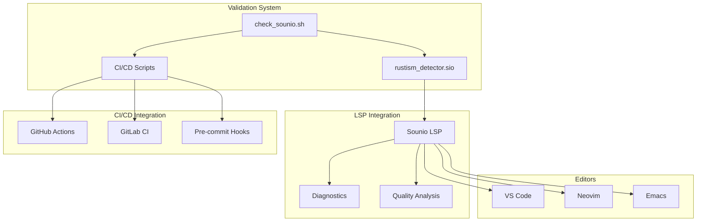

<!-- docs:meta
topic_id: repo.docs.compiler.integration-guide
authority: repo_only
audience: contributors
last_validated: 2026-03-07
validated_by: A4
source_of_truth: docs/governance/topic-registry.v1.json#repo.docs.compiler.integration-guide
-->

# Sounio Validation Integration Guide

## Overview

This guide covers the complete integration of the Sounio validation system with:
1. **Language Server Protocol (LSP)** - For real-time editor feedback
2. **CI/CD Pipelines** - For automated quality gates
3. **Development Workflows** - For local development

## Architecture



## Quick Start

### 1. Install the Validator
```bash
# Make the validator executable
chmod +x check_sounio.sh

# Test it on a file
./check_sounio.sh examples/hello.sio
```

### 2. Set Up LSP Integration
```bash
# Ensure the rustism detector is compiled
cd self-hosted/lsp
# The module will be automatically integrated into the LSP
```

### 3. Set Up CI/CD
```bash
# Run the setup script
bash scripts/ci/sounio_validation.sh github  # For GitHub Actions
# or
bash scripts/ci/sounio_validation.sh gitlab   # For GitLab CI
```

### 4. Set Up Pre-commit Hooks
```bash
# Install pre-commit hook
bash scripts/ci/sounio_validation.sh pre-commit
```

## LSP Integration Details

### How It Works

1. **File Modification Detection**: LSP detects when a `.sio` file is modified
2. **Validation Trigger**: The rustism detector runs `check_sounio.sh` on the file
3. **Output Parsing**: Results are parsed and converted to LSP diagnostics
4. **Editor Display**: Diagnostics appear in the editor's problems panel

### Configuration

Add to your editor's LSP settings:

**VS Code** (`settings.json`):
```json
{
  "sounio.lsp.rustismDetection": {
    "enabled": true,
    "level": "strict",
    "exclude": ["**/tests/**", "**/*.disabled"]
  }
}
```

**Neovim** (`init.lua`):
```lua
require('lspconfig').sounio.setup {
  settings = {
    sounio = {
      rustismDetection = {
        enabled = true,
        level = "strict"
      }
    }
  }
}
```

### Customizing Detection

You can customize what gets detected by modifying `check_sounio.sh`:

```bash
# To add a new pattern, add a check in the script:
echo "8. Checking for custom pattern:"
if grep -n "custom_pattern" "$file" > /dev/null; then
    echo -e "${RED}❌ Found custom pattern:${NC}"
    # ...
fi
```

## CI/CD Integration

### GitHub Actions

The workflow automatically:
1. Runs on pushes and pull requests
2. Validates all `.sio` files
3. Creates a validation report artifact
4. Comments on PRs with failures
5. Creates check runs for status reporting

### GitLab CI

The pipeline:
1. Runs validation on merge requests
2. Creates artifacts with validation reports
3. Provides manual extended validation
4. Integrates with GitLab's security scanning

### Custom CI Systems

For other CI systems, use the base script:
```bash
# Basic validation
bash scripts/ci/sounio_validation.sh validate

# Generate report
bash scripts/ci/sounio_validation.sh report
```

## Development Workflows

### Pre-commit Hooks

The pre-commit hook:
1. Runs automatically before `git commit`
2. Only checks staged `.sio` files
3. Prevents commits with validation errors
4. Allows warnings (configurable)

To bypass in emergencies:
```bash
git commit --no-verify -m "Emergency fix"
```

### IDE Integration

**VS Code Tasks** (`.vscode/tasks.json`):
```json
{
  "version": "2.0.0",
  "tasks": [
    {
      "label": "Validate Sounio",
      "type": "shell",
      "command": "./check_sounio.sh",
      "args": ["${file}"],
      "group": {
        "kind": "build",
        "isDefault": true
      },
      "presentation": {
        "reveal": "always",
        "panel": "dedicated"
      }
    }
  ]
}
```

**Makefile Integration**:
```makefile
.PHONY: validate test

validate:
	@echo "Validating Sounio files..."
	@bash scripts/ci/sounio_validation.sh validate

validate-file:
	@./check_sounio.sh $(FILE)

pre-commit:
	@bash scripts/ci/sounio_validation.sh pre-commit
```

## Advanced Configuration

### Severity Levels

Configure what fails CI vs what's just a warning:

```bash
# In scripts/ci/sounio_validation.sh
MAX_ERRORS=0  # Fail CI if any errors
WARNINGS_AS_ERRORS=false  # Treat warnings as errors
```

### File Exclusions

Exclude specific files or patterns:
```bash
# In the CI script
SKIP_PATTERNS=(
    "*.disabled"
    "*.backup"
    "tests/temp/*"
    "**/generated/**"
)
```

### Parallel Validation

For large codebases, validate in parallel:
```bash
# Example using GNU parallel
find . -name "*.sio" -type f | parallel -j 4 ./check_sounio.sh
```

## Monitoring and Metrics

### Validation Reports

Reports include:
- Timestamp of validation
- File-by-file results
- Error and warning counts
- Summary statistics

### Integration with Monitoring

```bash
# Send metrics to monitoring system
ERROR_COUNT=$(grep -c "❌" validation_report.txt)
WARNING_COUNT=$(grep -c "⚠" validation_report.txt)

# Send to Prometheus, Datadog, etc.
echo "sounio_validation_errors $ERROR_COUNT"
echo "sounio_validation_warnings $WARNING_COUNT"
```

## Troubleshooting

### Common Issues

1. **Validator not found**: Ensure `check_sounio.sh` is executable and in PATH
2. **Permission denied**: Run `chmod +x check_sounio.sh`
3. **No diagnostics in editor**: Check LSP client logs and ensure file has `.sio` extension
4. **CI pipeline fails**: Check the validation report artifact

### Debug Mode

Enable debug output:
```bash
bash scripts/ci/sounio_validation.sh validate 2>&1 | tee debug.log
```

### LSP Logs

Check LSP client logs for integration issues:
- VS Code: Output panel → Sounio LSP
- Neovim: `:LspLog`
- Emacs: `lsp-log-io` buffer

## Performance Optimization

### Caching

Cache validation results:
```bash
# Simple file-based cache
CACHE_DIR=".sounio-validation-cache"
FILE_HASH=$(md5sum "$file" | cut -d' ' -f1)
CACHE_FILE="$CACHE_DIR/$FILE_HASH"

if [ -f "$CACHE_FILE" ] && [ "$file" -ot "$CACHE_FILE" ]; then
    # Use cached results
    cat "$CACHE_FILE"
else
    # Run validation and cache
    ./check_sounio.sh "$file" > "$CACHE_FILE"
    cat "$CACHE_FILE"
fi
```

### Incremental Validation

Only validate changed files:
```bash
# Get changed .sio files
CHANGED_FILES=$(git diff --name-only HEAD~1 HEAD | grep '\.sio$')

if [ -n "$CHANGED_FILES" ]; then
    for file in $CHANGED_FILES; do
        ./check_sounio.sh "$file"
    done
fi
```

## Extending the System

### Adding New Validators

1. Create a new validation script
2. Integrate with the CI script
3. Add to LSP if needed
4. Update documentation

### Custom Rules

Create project-specific rules:
```bash
# In check_sounio.sh, add:
echo "9. Checking project-specific rules:"
if grep -n "deprecated_pattern" "$file" > /dev/null; then
    echo -e "${YELLOW}⚠  Found deprecated pattern${NC}"
    # ...
fi
```

## Support and Resources

- **Documentation**: See `CHECK_SOUNIO_GUIDE.md`
- **Examples**: Check `examples/` directory
- **Issues**: File in the repository issue tracker
- **Contributing**: See `CONTRIBUTING.md`

## License

This validation system is part of the Sounio project and follows the same licensing terms.
