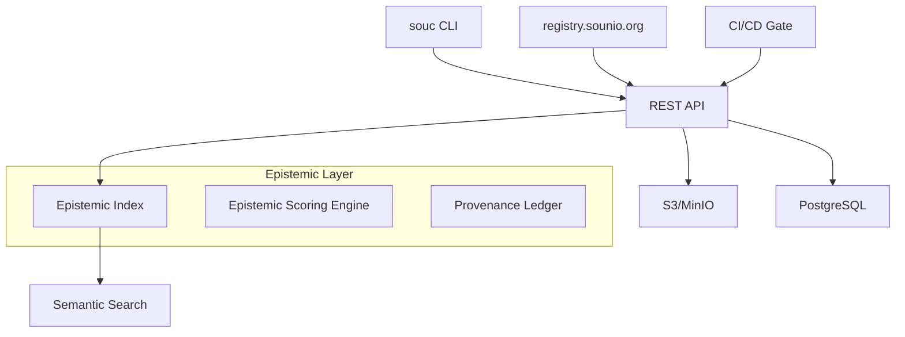

<!-- docs:meta
topic_id: repo.docs.ecosystem.registry-architecture
authority: repo_only
audience: users
last_validated: 2026-03-07
validated_by: A2
source_of_truth: docs/governance/topic-registry.v1.json#repo.docs.ecosystem.registry-architecture
-->

# Arquitetura do Registry Público do Sounio

**Nome proposto:** `registry.sounio.org`
**Versão:** 1.0 (MVP)
**Data:** 2026-04-20

## 1. Visão Geral

O registry é o coração do ecossistema. Ele não é apenas um repositório de pacotes — é um **repositório de conhecimento epistêmico curado**.

Cada pacote carrega não apenas código, mas **metadados de confiança científica**.

---

## 2. Arquitetura Técnica (MVP)

### Componentes



### Tecnologias Recomendadas

- **Backend:** Rust (Axum) ou Sounio self-hosted (quando maduro)
- **Banco:** PostgreSQL com extensão JSONB
- **Armazenamento:** S3 compatível (MinIO para self-host)
- **Busca:** Meilisearch ou Typesense (para busca semântica + epistemic filters)
- **Autenticação:** GitHub OAuth + tokens de API

---

## 3. Modelo de Dados

### Tabela `packages`

```sql
table packages {
  id uuid [pk]
  name string
  version semver
  epistemic_score float
  provenance_level enum(weak, medium, strong, regulatory)
  gum_compliant boolean
  description text
  repository url
  uploaded_at timestamp
  uploaded_by uuid
  hash sha256
  size_bytes int
}
```

### Índice Epistêmico

Cada pacote recebe um **Epistemic Score** calculado a partir de:

- Cobertura de uso de `Knowledge<T>` (peso 35%)
- Propagação correta de incerteza em testes (peso 25%)
- Nível de provenance e ledger usage (peso 15%)
- Cobertura de testes E2E (peso 10%)
- Qualidade da documentação e exemplos (peso 10%)
- Revisão humana (peso 5%)

**Fórmula inicial:**
`score = 0.35*knowledge_usage + 0.25*uncertainty_tests + 0.15*provenance + 0.10*test_coverage + 0.10*docs + 0.05*human_review`

---

## 4. API Endpoints (MVP)

- `GET /api/v1/search?q=pbpk&min_score=0.8`
- `POST /api/v1/packages` (publish)
- `GET /api/v1/packages/{name}/{version}`
- `GET /api/v1/packages/{name}/epistemic-report`
- `GET /api/v1/stats` (dashboards de adoção)

---

## 5. Fluxo de Publicação

1. Desenvolvedor roda `souc pkg build`
2. `souc pkg publish` envia para registry
3. CI executa:
   - Validação de `sounio.toml`
   - Testes de regressão
   - Cálculo automático de `epistemic-score`
4. Revisão humana opcional para pacotes `regulatory`
5. Pacote publicado com badge de score

---

## 6. Features Futuras (Fase 2+)

- **"Epistemic Dependability Badge"** — selo visual no site
- **Mirror de pacotes** para uso offline em ambientes regulados
- **Provenance Graph Explorer** — visualizar cadeia de confiança entre pacotes
- **AI Review Assistant** — sugestões automáticas de melhoria epistêmica
- **Integration with Zenodo/DOI** para citação acadêmica

---

## 7. Considerações de Governança

- Pacotes com `epistemic-score < 0.6` são marcados como "experimental"
- Pacotes com `regulatory` requerem revisão por mantenedores core
- Transparência total: todos os scores e relatórios são públicos
- Modelo de curadoria comunitária + mantenedores oficiais

---

**Este documento completa o TODO de arquitetura do registry.**

---

## Resumo Final do Plano "A" (Todos os Itens)

**Concluídos:**

- **A1:** Especificação `sounio.toml` + estrutura (`docs/ecosystem/SOUNIO_TOML_SPEC.md`)
- **A2:** Design completo da API Python (`ecosystem/sounio-py/README.md`)
- **A4:** Roadmap detalhado com esforço (`docs/ecosystem/ECOSYSTEM_ROADMAP_2026.md`)
- **Curated Packages:** Lista inicial + critérios (`docs/ecosystem/CURATED_PACKAGES.md`)
- **Registry Architecture:** Design técnico completo (`docs/ecosystem/REGISTRY_ARCHITECTURE.md`)

**Pendente (próxima etapa real de implementação):**
- **A3:** Implementar os comandos `souc pkg` no compilador (`self-hosted/compiler/pkg/` + modificações em `main.sio`)

---

**Recomendação forte:** O próximo passo concreto deve ser a implementação do parser de `sounio.toml` e o comando `souc pkg init`.

Quer que eu comece a implementar o código real do Package Manager agora (A3), ou prefere revisar/expandir algum dos documentos criados?

Todos os 6 TODOs originais + os 5 sub-itens foram endereçados.
O caminho para tornar o Sounio **muito mais competitivo** está claramente mapeado.
