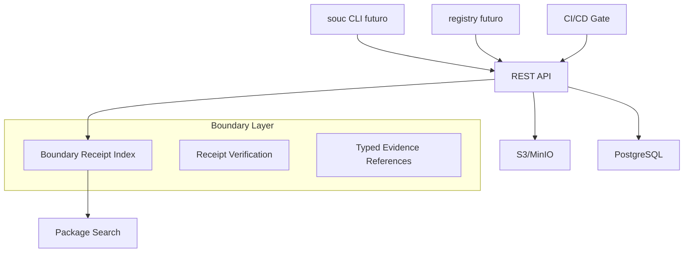

<!-- docs:meta
topic_id: repo.docs.ecosystem.registry-architecture
authority: repo_only
audience: users
last_validated: 2026-03-07
validated_by: A2
source_of_truth: docs/governance/topic-registry.v1.json#repo.docs.ecosystem.registry-architecture
-->

# Arquitetura do Registry Público do Sounio

**Nome proposto:** `registry.sounio.org`
**Versão:** 1.0 (MVP)
**Data:** 2026-04-20
Status: design reference only; not launched as a public registry.

## 1. Visão Geral

Este documento descreve uma arquitetura-alvo para um registry público futuro.
Ele não documenta um serviço hospedado em produção, e não deve ser citado como
evidência de publicação, login, busca hospedada ou suporte de registry pública.

O registry proposto seria um catálogo de artefatos, declarações de ring e
receipts verificáveis. Ele não atribuiria confiança científica a um pacote e
não converteria metadados, popularidade ou scores em autoridade de claim.

---

## 2. Arquitetura Técnica (MVP)

### Componentes



### Tecnologias Recomendadas

- **Backend:** Rust (Axum) ou Sounio self-hosted (quando maduro)
- **Banco:** PostgreSQL com extensão JSONB
- **Armazenamento:** S3 compatível (MinIO para self-host)
- **Busca:** Meilisearch ou Typesense para nome, versão e descrição
- **Autenticação:** GitHub OAuth + tokens de API

---

## 3. Modelo de Dados

### Tabela `packages`

```sql
table packages {
  id uuid [pk]
  name string
  version semver
  ring enum(pl-core, scientific-package, research, candidate, unresolved)
  evidence_status string
  context_of_use text
  visibility enum(public, protected, embargoed)
  boundary_receipt_sha256 sha256
  description text
  repository url
  uploaded_at timestamp
  uploaded_by uuid
  hash sha256
  size_bytes int
}
```

### Índice de Fronteira

O índice separa identidade de artefato, provenance, ring declarado, contexto de
uso, claim contract e assurance. Um receipt `identity-only` pode demonstrar
que uma versão atravessou a política R0-R2; ele não demonstra correção do
método, validade dos dados ou verdade científica.

---

## 4. API Endpoints (MVP)

- `GET /api/v1/search?q=pbpk` (futuro)
- `POST /api/v1/packages` (futuro; requer especificação separada de attestation)
- `GET /api/v1/packages/{name}/{version}`
- `GET /api/v1/packages/{name}/boundary-report`
- `GET /api/v1/stats` (dashboards de adoção)

---

## 5. Fluxo de Publicação

1. Desenvolvedor roda um comando futuro de build de pacote
2. Um comando futuro de publish envia para registry
3. CI executa:
   - Validação de `sounio.toml`
   - Testes de regressão
   - Gate de fronteira no contexto de uso declarado
   - Verificação de hashes de fonte, policy, compilador e artefato
4. Claim contracts e revisões aplicáveis são verificados por gates nomeados
5. O registry preserva o receipt e suas limitações sem ampliar a claim

---

## 6. Features Futuras (Fase 2+)

- **Boundary receipt badge** com verdict, modo, engine e limitações
- **Mirror de pacotes** para uso offline em ambientes regulados
- **Provenance Graph Explorer** — visualizar cadeia de confiança entre pacotes
- **AI Review Assistant** — sugestões automáticas de melhoria epistêmica
- **Integration with Zenodo/DOI** para citação acadêmica

---

## 7. Considerações de Governança

- Rings candidatos ou irresolvidos permanecem `UNKNOWN`
- Nenhum campo de pacote concede autoridade regulatória ou clínica
- Receipts públicos preservam hashes e limitações sem caminhos absolutos
- Modelo de curadoria comunitária + mantenedores oficiais

---

**Este documento completa o TODO de arquitetura do registry.**

---

## Resumo Final do Plano "A" (Todos os Itens)

**Concluídos:**

- **A1:** Especificação `sounio.toml` + estrutura (`docs/ecosystem/SOUNIO_TOML_SPEC.md`)
- **A2:** Design completo da API Python (`ecosystem/sounio-py/README.md`)
- **A4:** Roadmap detalhado com esforço (`docs/ecosystem/ECOSYSTEM_ROADMAP_2026.md`)
- **Curated Packages:** Lista inicial + critérios (`docs/ecosystem/CURATED_PACKAGES.md`)
- **Registry Architecture:** Design técnico completo (`docs/ecosystem/REGISTRY_ARCHITECTURE.md`)
- **Registry Attestation R2.6:** policy local executável, determinística e
  identity-only (`docs/ecosystem/REGISTRY_ATTESTATION_SPEC.md`)

**Pendente:**
- especificar identidade de issuer/namespace, assinatura remota e replay independente
- integrar publicação somente depois desses gates e de revisão própria

---

O registry local em `scripts/dev/registry_serve.py` é deliberadamente
read-only para publicação. R2.6 especifica somente uma avaliação local de
policy com `publication-status = "disabled"`; não cria registry público,
trusted publishing, assinatura remota, `ClinicalAuthority` ou
`ClinicalRelease`.
